# libxtm: Architecture & Technical Specification

This document is the design specification for **libxtm** — a C++ library and
associated tooling for efficient storage, compression, decompression,
analysis, and streaming of large digital elevation models (DEMs). It covers
the project's goals, data model, architecture, interfaces, codec design,
container format, quality metrics, and development plan.

Implementation details of the current codec are documented separately in
`docs/pipeline.md`; this spec describes the target design.

## Contents

1. [Context](#1-context)
2. [Compression Concepts](#2-compression-concepts)
3. [Architecture](#3-architecture)
4. [Interfaces](#4-interfaces)
5. [Codec Design](#5-codec-design)
6. [Format, Random Access & Decoding](#6-format-random-access--decoding)
7. [Analysis & Quality](#7-analysis--quality)
8. [Targets & Benchmarking](#8-targets--benchmarking)

---

## 1. Context

### 1.1 Overview

The initial development target is the **Copernicus DEM GLO-30** dataset, but
libxtm is intended to remain independent of Copernicus, GeoTIFF, GDAL, or any
particular terrain source.

The project consists of three primary interfaces:

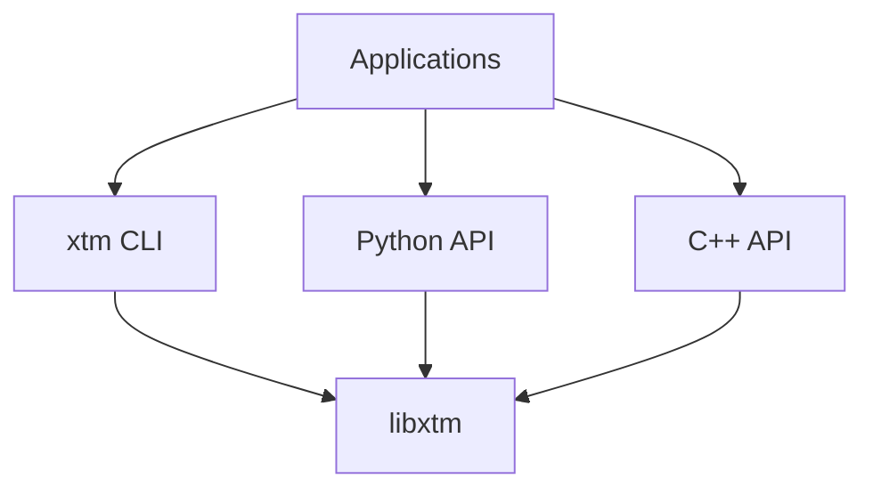

The C++ library is the authoritative implementation. The CLI and Python
package are front ends over the same library rather than independent
implementations.

The project has two related objectives:

1. Develop an efficient terrain-specific compression codec.
2. Develop XTM as a practical format for storing and randomly accessing large
   terrain datasets.

Compression ratio is important, but the format should not sacrifice decoding
speed, random access, scalability, or terrain quality merely to achieve the
smallest possible archive.

### 1.2 Motivation

Global elevation datasets contain enormous amounts of spatial redundancy.
Terrain elevations are not independent samples; neighboring samples are
strongly correlated because terrain generally changes continuously across
space.

A sequence such as:

```text
4200
4204
4208
4212
4216
```

contains much less information than storing five unrelated numbers would
imply. A terrain-aware compressor can model the underlying spatial structure
and encode only deviations from that structure.

General-purpose compressors operate primarily on the byte representation of
the data. **libxtm** instead operates on the terrain itself.

Conceptually:

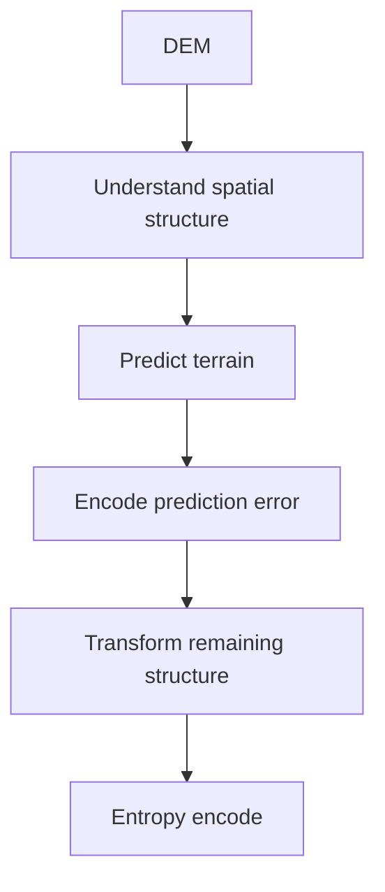

The entropy coder should not be responsible for discovering the geometry of
the terrain.

### 1.3 Initial Dataset

The first development and benchmark dataset is **Copernicus DEM GLO-30**.

The initial test tile is:
`Copernicus_DSM_COG_10_N27_00_E086_00_DEM.tif`

It covers approximately:

```text
Latitude:   27° N → 28° N
Longitude:  86° E → 87° E
```

This places it in highly mountainous Himalayan terrain, making it deliberately
challenging for compression.

**Tile properties:**

| Property | Value |
|---|---|
| **Dimensions** | 3600 × 3600 |
| **Samples** | 12,960,000 |
| **Sample type** | Float32 |
| **CRS** | EPSG:4326 |
| **Angular spacing** | 1/3600° |
| **Coverage** | 1° × 1° |
| **Layout** | COG (Cloud Optimized GeoTIFF) |
| **Compression** | DEFLATE |
| **TIFF predictor** | 3 (Floating Point) |

At approximately 27.5° latitude, the physical tile dimensions are roughly:

```text
North–South   ~111 km
East–West     ~99 km
Area          ~11,000 km²
```

The horizontal sample spacing is approximately 30 m.

The uncompressed elevation raster occupies:

$$\text{Uncompressed Size} = 12,960,000 \times 4\text{ bytes} \approx 51.84\text{ MB}$$

before container metadata or additional products.

The existing source is already DEFLATE compressed with a floating-point
predictor, so comparisons against the original GeoTIFF are comparisons against
an existing compressed representation rather than raw Float32 storage.

### 1.4 Scope

libxtm should eventually support:

- Error-bounded near-lossless terrain compression
- Error-bounded terrain compression
- Configurable vertical precision
- Adaptive terrain prediction
- Reversible transforms
- Entropy coding
- Random-access decompression
- Region-of-interest decoding
- Multiresolution terrain
- CPU implementations
- Streaming large datasets
- C++ applications
- Python/NumPy workflows
- Benchmarking and codec research

The format should not assume that its input originated as GeoTIFF.

### 1.5 Guiding Design Principles

1. **Terrain First:** Model underlying spatial geometry, not just arbitrary byte streams.
2. **Measure Everything:** Every stage must quantitatively prove its bitrate or speed benefit.
3. **Single Codec Engine:** CLI, Python, and C++ bindings share the exact same core C++ library.
4. **Keep I/O Separate:** GDAL is an adapter layer, not part of the compression codec.
5. **Explicit Loss Control:** Error-bounded loss is strictly controlled by explicit quantization parameters.
6. **Prioritize Random Access:** Enable direct application querying without full-file decompression.
7. **Decode Speed Matters:** Fast decompression and low latency are prioritized over marginal size gains.
8. **Avoid Premature Complexity:** Reject features whose compression gains do not justify their implementation cost.

---

## 2. Compression Concepts

### 2.1 The Compression Model

The core model is:

$$Z = P + R$$

where:

- $Z$ is the actual elevation
- $P$ is a deterministic prediction
- $R$ is the residual

Therefore:

$$R = Z - P$$

During decompression:

$$Z = P + R$$

The predictor does not have to predict perfectly. It only needs to reduce the
entropy of the resulting residual distribution.

**Example:**

```text
Actual:      4200  4205  4211  4216  4221
Prediction:  4200  4205  4210  4216  4222
Residual:       0     0    +1     0    -1
```

The residual stream is substantially easier to encode than the original
elevations.

### 2.2 Error-Bounded Compression

libxtm is fundamentally an **error-bounded near-lossless codec**. It does not
attempt to compress and reconstruct exact IEEE-754 floating-point bits, as
sub-scale precision is considered irrelevant for typical terrain
applications.

**Lossless ingestion.** To ensure that precision is only intentionally
discarded by the user, the codec relies on strict `Float64` ingestion. When
reading a source dataset (e.g., via GDAL), data is loaded exactly into a
`TerrainBuffer` (backed by `double`). This guarantees that whether the source
is `Float64`, `Float32`, `Int32`, or `Int16`, no truncation occurs prior to
the explicit quantization step.

**Error bounds.** For many terrain applications, the numerical precision
contained in Float32 is far beyond the actual useful precision of a ~30 m DEM.

Instead, select a vertical quantization interval $q$ and encode:

$$Q(z) = \text{round}\left(\frac{z}{q}\right)$$

The reconstructed elevation is:

$$\hat{z} = q \cdot Q(z)$$

For nearest-value quantization, the bound is:

$$|z - \hat{z}| \le \frac{q}{2}$$

Example quantization steps:

```text
q = 0.01 m
q = 0.10 m
q = 0.25 m
q = 0.50 m
q = 1.00 m
q = 2.00 m
```

The rest of the codec remains lossless with respect to the quantized
representation. Thus, intentional information loss occurs at one clearly
defined stage.

### 2.3 Float32 Precision

The source raster uses Float32, but values printed with many decimal places
should not be interpreted as having that many meaningful decimal digits.

Float32 provides approximately 24 bits of significand precision,
corresponding to roughly seven significant decimal digits.

At Himalayan elevations around 4,000–8,000 m, Float32 can represent vertical
increments on the order of sub-millimeters. That numerical precision does not
imply equivalent measurement accuracy.

The effective useful precision depends on:

- DEM acquisition method
- Vertical accuracy
- Horizontal resolution
- Terrain roughness
- Application
- Rendering scale
- Slope and curvature requirements

Therefore libxtm should empirically investigate the relationship between
vertical precision, compressed size, and terrain feature preservation.

### 2.4 Fixed-Point Representation

For error-bounded modes, decimal elevations should be converted into integer
fixed-point values before most compression stages.

For $0.01\text{ m}$ precision:

$$4231.37\text{ m} \longrightarrow 423137 \quad (\text{scale} = 0.01\text{ m})$$

For $0.1\text{ m}$ precision:

$$4231.4\text{ m} \longrightarrow 42314 \quad (\text{scale} = 0.1\text{ m})$$

The codec can then operate primarily on integers.

**Benefits:**

- Deterministic arithmetic
- Exact residual reconstruction
- Simpler predictors
- Reversible transforms
- Easier entropy modeling
- Reduced floating-point noise

### 2.5 Local Reference Elevation

Absolute terrain height often contains information that does not need to be
repeated for every sample.

A block containing:

```text
5000.12
5000.18
5000.31
5000.45
```

could use:

$$\text{base} = 5000.00$$

and represent the values relative to that reference.

At centimeter precision:

```text
12
18
31
45
```

Prediction then operates on these local values.

Whether explicit local offsets improve final entropy after prediction should
be measured rather than assumed.

---

## 3. Architecture

### 3.1 System Overview

libxtm should be developed as:

1. A C++ library (core engine)
2. A command-line executable (`xtm`)
3. Python bindings (`xtm` Python package)

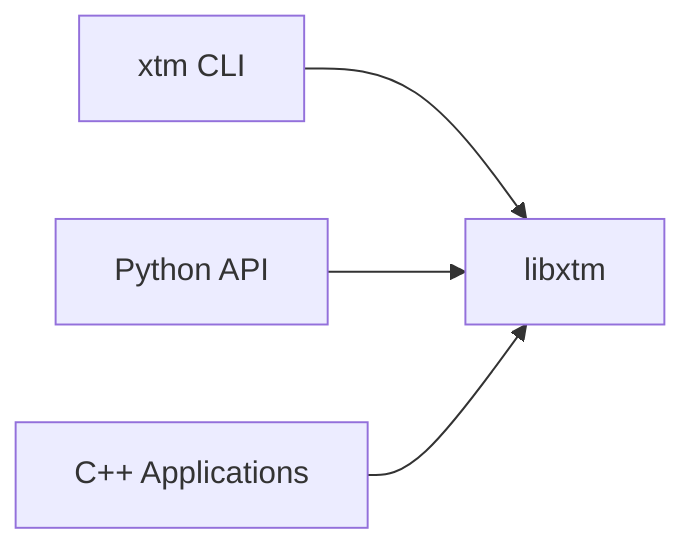

No codec implementation should be duplicated across interfaces.

### 3.2 Long-Term Architecture

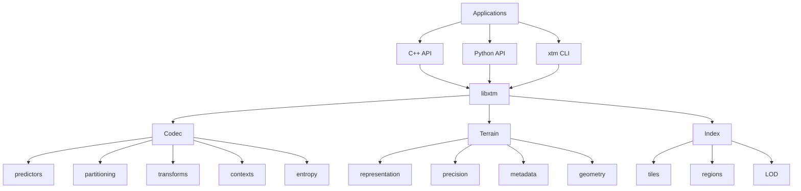

The project begins as a terrain compression experiment. The architecture
leaves room for it to become a high-performance terrain storage and streaming
system supporting global DEM datasets, simulations, visualization, GIS
workflows, and other applications requiring efficient access to large
elevation fields.

### 3.3 Proposed Repository Structure

```text
libxtm/
├── CMakeLists.txt
├── CMakePresets.json
├── README.md
├── LICENSE
│
├── include/
│   └── xtm/
│       ├── xtm.hpp
│       ├── Encoder.hpp
│       ├── Decoder.hpp
│       ├── Terrain.hpp
│       ├── Options.hpp
│       └── Error.hpp
│
├── src/
│   ├── Encoder.cpp
│   ├── Decoder.cpp
│   │
│   ├── terrain/
│   │   ├── Terrain.cpp
│   │   └── Quantization.cpp
│   │
│   ├── predictor/
│   │   ├── Predictor.hpp
│   │   ├── Left.cpp
│   │   ├── Gradient.cpp
│   │   ├── JpegLs.cpp
│   │   └── Plane.cpp
│   │
│   ├── partition/
│   │   └── Quadtree.cpp
│   │
│   ├── transform/
│   │   └── Wavelet.cpp
│   │
│   ├── entropy/
│   │   ├── Model.cpp
│   │   └── Rans.cpp
│   │
│   ├── container/
│   │   ├── Reader.cpp
│   │   ├── Writer.cpp
│   │   └── Index.cpp
│   │
│   └── io/
│       └── GDAL.cpp
│
├── apps/
│   └── xtm/
│       ├── main.cpp
│       ├── EncodeCommand.cpp
│       ├── DecodeCommand.cpp
│       └── AnalyzeCommand.cpp
│
├── bindings/
│   └── python/
│       ├── module.cpp
│       └── CMakeLists.txt
│
├── tests/
│   ├── predictor/
│   ├── transform/
│   ├── codec/
│   └── roundtrip/
│
├── benchmarks/
├── tools/
└── python/
    ├── examples/
    └── notebooks/
```

---

## 4. Interfaces

### 4.1 Command-Line Interface

The executable is named `xtm`.

**Commands:**

```bash
xtm analyze terrain.tif
xtm encode terrain.tif terrain.xtm
xtm decode terrain.xtm terrain.tif
xtm info terrain.xtm
xtm verify terrain.xtm terrain.tif
```

**Encoding options:**

```bash
xtm encode input.tif output.xtm --scale 0.01
xtm encode input.tif output.xtm --threads 16
```

The CLI should primarily:

1. Parse arguments
2. Construct libxtm options
3. Call libxtm
4. Report results

Compression logic does not belong in `main.cpp`.

### 4.2 C++ API

The authoritative C++ surface is the file-level API in `xtm::api`
(`#include <xtm/Api.hpp>`). All functions throw `std::invalid_argument` on
invalid options and `std::runtime_error` on I/O or codec failures; parallel
work uses `num_threads` workers (0 = hardware concurrency).

**Encoding:**

```cpp
#include <xtm/Api.hpp>

xtm::api::EncodeOptions options;
options.precision = 0.01;
options.num_threads = 16;

auto result = xtm::api::encode_file("terrain.tif", "terrain.xtm", options);
```

**Decoding (full or region):**

```cpp
auto full = xtm::api::decode_file("terrain.xtm", "terrain.tif");

xtm::api::DecodeOptions opts;        // region 0,0,0,0 = full grid
opts.region_x = 0;
opts.region_y = 0;
opts.region_width = 512;
opts.region_height = 512;
auto roi = xtm::api::decode_file("terrain.xtm", "roi.tif", opts);
```

**Analysis, inspection, verification:**

```cpp
auto report = xtm::api::analyze_file("terrain.tif", options);
auto info = xtm::api::info_file("terrain.xtm");
auto check = xtm::api::verify_file("terrain.xtm", "terrain.tif");
```

**Options summary:**

| Option | Type | Default | Meaning |
|---|---|---|---|
| `EncodeOptions::precision` | `double` | `1.0` | vertical quantization step (m) |
| `EncodeOptions::context_model` | `coding::ContextModel` | `Simple` | `Simple` or `Extended` context model |
| `EncodeOptions::pipeline_type` | `analyzer::PipelineType` | `Predictor` | `Predictor` or `Wavelet` pipeline |
| `EncodeOptions::disable_quadtree` | `bool` | `false` | fixed 64×64 blocks instead of quadtree |
| `EncodeOptions::num_threads` | `uint32_t` | `0` | worker count; 0 = hardware concurrency |
| `DecodeOptions::region_*` | `uint32_t` | `0` | decode only `[x, x+w) × [y, y+h)`; all-zero = full grid |

Results arrive as `EncodeResult`, `DecodeResult`, `FileInfo`, `VerifyResult`,
and `analyzer::AnalysisReport` structs.

**Planned** — an in-memory variant that compresses and decompresses a
`TerrainBuffer` directly, without passing through GDAL.

### 4.3 Python Bindings

The `xtm` Python package (built with nanobind) exposes the same file-level
API backed by the same core library. Invalid arguments raise `ValueError`;
I/O and codec failures raise `RuntimeError`. Heavy calls release the GIL.

**Encoding:**

```python
import xtm

result = xtm.encode(
    "terrain.tif",
    "terrain.xtm",
    precision=0.1,
    pipeline="predictor",     # "predictor" | "wavelet"
    context="simple",         # "simple" | "extended"
    disable_quadtree=False,
    num_threads=0,            # 0 = all cores
)
```

**Decoding (full or region):**

```python
full = xtm.decode("terrain.xtm", "terrain.tif")
roi = xtm.decode("terrain.xtm", "roi.tif", region=(0, 0, 512, 512))
```

**Analysis, inspection, verification:**

```python
report = xtm.analyze("terrain.tif", precision=1.0, wavelets=False)
info = xtm.info("terrain.xtm")
print(info.width, info.height, info.precision)
ok = xtm.verify("terrain.xtm", "terrain.tif")
print(xtm.version())
```

The functions return `EncodeResult`, `DecodeResult`, `FileInfo`,
`VerifyResult`, and `AnalysisReport` objects with read-only fields.
`analyze` returns the full decision report: dimensions, NoData share,
raw/quantized statistics, precision guidance, per-predictor performance,
quadtree analysis, entropy budget, and optional wavelet evaluation.

**Planned** — a decode variant that returns an in-memory NumPy array instead
of writing a GeoTIFF.

### 4.4 Zero-Copy Python Integration

Large terrain arrays should not be copied unnecessarily.

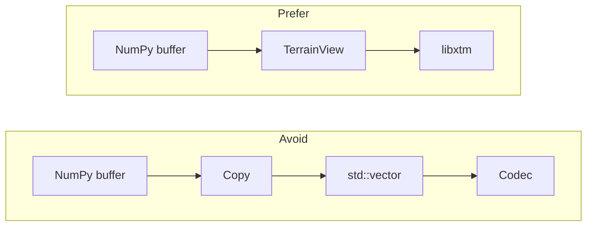

The binding passes pointer, shape, stride, and sample type directly into C++.

### 4.5 GDAL Integration

GDAL belongs at the I/O boundary:

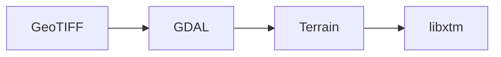

The codec should not depend conceptually on TIFF structures. This allows
future input from:

- Copernicus DEM
- SRTM
- LiDAR-derived rasters
- Procedural terrain
- Application memory
- NumPy arrays
- Custom raster formats

---

## 5. Codec Design

### 5.1 Pipeline Overview

The working pipeline is:

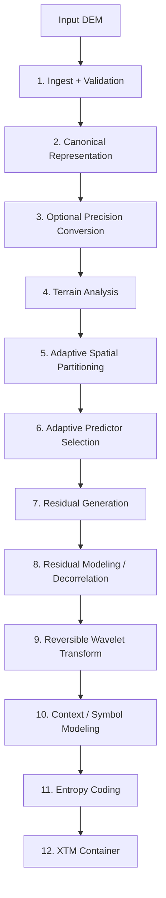

Not every stage is guaranteed to remain in the final codec. Each stage must
demonstrate measurable benefit.

### 5.2 Ingest and Validation

The input layer reads source data and converts it into libxtm's canonical
terrain representation.

For GeoTIFF sources, GDAL can handle:

- Raster decoding
- Dimensions
- Sample types
- Geotransforms
- CRS
- NoData values
- Metadata

TIFF-specific storage details should not propagate into the compression core.

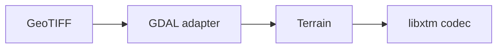

Other sources can provide `Terrain` directly.

### 5.3 Canonical Terrain Representation

A simplified conceptual C++ representation:

```cpp
struct TerrainView {
    const double* data;

    std::uint32_t width;
    std::uint32_t height;

    GeoTransform transform;
    std::optional<double> nodata_value;
    std::string wkt_projection;
};
```

The real representation may additionally contain:

- Sample format
- Vertical scale
- Geographic extent
- Memory layout

The compression core should operate on this representation rather than GDAL
objects.

### 5.4 Terrain Analysis

Before designing the final codec, libxtm needs to characterize real terrain
statistically.

For each tile and potentially each region, calculate:

**Elevation statistics:**

- Minimum elevation ($z_{\min}$)
- Maximum elevation ($z_{\max}$)
- Mean elevation ($\mu_z$)
- Standard deviation ($\sigma_z$)

**First differences:**

Horizontal:

$$D_x(x,y) = Z(x,y) - Z(x-1,y)$$

Vertical:

$$D_y(x,y) = Z(x,y) - Z(x,y-1)$$

**Second differences:** useful for understanding curvature and predictor
performance.

**Histograms:** measure distributions of:

- Elevation
- Horizontal differences
- Vertical differences
- Predictor residuals
- Transformed coefficients

**Entropy:** estimate Shannon entropy:

$$H(X) = -\sum_{x} p(x) \log_2 p(x)$$

and report results as `bits/sample`. This becomes the main compression metric.

### 5.5 Predictors

A predictor is a deterministic function that estimates the current sample
from already known information.

Consider a 2×2 spatial neighborhood:

```text
A  B
C  X
```

where `X` is the sample being encoded.

A predictor computes:

$$P(X) = f(A, B, C, \dots)$$

and stores the residual:

$$R = X - P(X)$$

The decoder runs the same predictor and reconstructs:

$$X = P(X) + R$$

### 5.6 Predictor Candidates

The predictor bank is optimized for high-performance and compression
efficiency.

**Left**

$$P(X) = C$$

**Gradient**

$$P(X) = B + C - A$$

This models a locally planar gradient.

**JPEG-LS Predictor**

A nonlinear edge-aware predictor that avoids some gradient predictor failures
around discontinuities:

$$P(X) = \begin{cases} \min(B, C) & \text{if } A \ge \max(B, C) \\ \max(B, C) & \text{if } A \le \min(B, C) \\ B + C - A & \text{otherwise} \end{cases}$$

**Polynomial Predictor**

Approximate local terrain as a surface:

$$z = c_1 + c_2 x + c_3 y + c_4 x^2 + c_5 xy + c_6 y^2 + \dots$$

Dynamic order selection (1, 2, or 3) allows fitting everything from simple
slopes to hills. Coefficients are evaluated using least-squares and passed
encoded into the stream.

**Gap Predictor**

Approximates gaps between macro-features.

**Least Squares Predictor**

Uses surrounding context to dynamically build a local least-squares linear
predictor for localized gradients.

**Second-Order Residual Pass**

Instead of an independent second-order predictor, a universal second-order
pass can be applied to the residuals produced by any primary predictor. The
residuals are re-predicted by a **pool** of residual predictors —
`Average (p = W/2 + N/2)`, `Median (W, N, NW)`, and the
Left/Gradient/Gap/LeastSquares classes over a zero-bordered residual-plane
view. The cheapest pair wins, signalled by a 3-bit `ResidualPredictorId` in
the predictor byte; a 16-bit acceptance barrier compensates for run-table
adaptation overhead the estimator cannot see.

### 5.7 Adaptive Predictor Selection

Different terrain regions favor different predictors. A flat region, smooth
mountain slope, ridge, valley, and cliff should not necessarily use the same
model.

For each block, candidate predictors are evaluated. For predictor $P$:

$$R_P = Z - P(Z)$$

Estimate total cost:

$$C(P) = C_{\text{ID}} + C_{\text{parameters}} + C_{\text{residual}}$$

Then select:

$$P^* = \arg\min_P C(P)$$

The goal is not to identify terrain semantically; the goal is to choose the
representation requiring the fewest encoded bits.

### 5.8 Adaptive Spatial Partitioning

Terrain complexity varies spatially. A fixed block size may waste metadata in
smooth regions while failing to model complicated regions accurately.

A hierarchical partition can begin with large blocks (e.g. 512 × 512) and
recursively split:

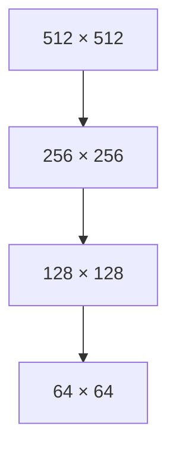

The split decision should ultimately optimize:

$$C = C_{\text{model}} + C_{\text{residual}} + C_{\text{partition}}$$

Split only when:

$$C_{\text{children}} < C_{\text{parent}}$$

This prevents the partitioner from improving prediction while making the
final bitstream larger. A minimum block size around 64 × 64 is a reasonable
initial experiment, not a fixed specification.

### 5.9 Residual Generation

After predictor selection:

$$R(x,y) = Z(x,y) - P(x,y)$$

Instead of elevations in the thousands of meters, the resulting stream may
consist largely of values around zero.

**Example:**

```text
Actual:      4231  4235  4238  4244
Prediction:  4230  4234  4239  4242
Residual:      +1    +1    -1    +2
```

Residual entropy, not residual magnitude alone, determines compressibility.

### 5.10 Residual Decorrelation

Prediction may not remove all spatial correlation. Residuals themselves can
contain patterns, for example:

```text
0  0  0  1  1  1  0  0  0
```

A secondary reversible transform may reduce this structure. Whether this
stage is worthwhile should be established experimentally.

### 5.11 Wavelet Transform

Wavelet decomposition remains a major candidate. Instead of necessarily
transforming raw terrain, the current working hypothesis is to test wavelets
primarily on predictor residuals.

A 2D transform produces:

```text
        Residual
           │
           ▼
    ┌──────┬──────┐
    │  LL  │  LH  │
    ├──────┼──────┤
    │  HL  │  HH  │
    └──────┴──────┘
```

The LL component can recursively decompose.

For lossless operation, the transform must be exactly reversible, likely
through integer lifting.

Transform modes can be adaptive:

- `0`: No transform
- `1`: Wavelet level 1
- `2`: Wavelet level 2
- `3`: Wavelet level 3

The encoder chooses whichever produces the smallest total representation.
Wavelets are not assumed to improve every block.

### 5.12 Context Modeling

After prediction and transforms, coefficient distributions may depend
strongly on context.

Possible context variables include:

- Wavelet subband (LL, HL, LH, HH) or Precision Subband (for sub-meter split)
- Transform level
- Predictor type
- Neighboring coefficient magnitudes
- Previous residual magnitude

An initial model might use:

$$\text{context} = (\text{subband}, \text{magnitudeClass})$$

rather than a highly complex model.

The number of contexts should remain controlled because context tables
themselves introduce memory, initialization, and computational costs.

### 5.13 Symbol Representation

Signed residuals may be mapped to nonnegative integers (ZigZag encoding).

For example:

```text
 0  ──►  0
-1  ──►  1
+1  ──►  2
-2  ──►  3
+2  ──►  4
...
```

Zero runs may also be represented separately when transformed data contains
sufficiently many zeros.

Possible decomposition:

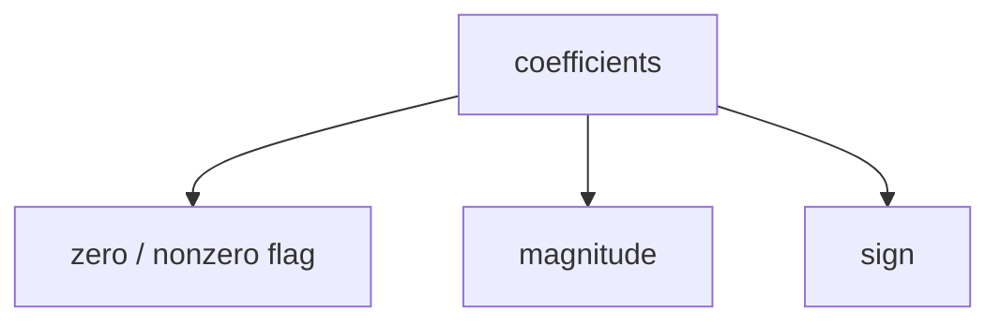

Whether this outperforms direct signed-symbol entropy coding must be
benchmarked.

### 5.14 Entropy Coding

Candidate entropy coders include:

- **rANS** (Asymmetric Numeral Systems)
- **Range coding**

rANS is currently a strong candidate because it offers:

- High decode throughput
- Compression close to arithmetic coding
- Pure integer implementation
- SIMD optimization opportunities
- Suitability for independent streams

---

## 6. Format, Random Access & Decoding

### 6.1 XTM Container

The codec and container should remain conceptually separate. The **codec**
converts terrain into compressed streams; the **XTM format** organizes those
streams for storage and retrieval.

A conceptual structure:

```mermaid
flowchart TD
    XTM[XTM File] --> FH[Fixed Header]
    FH --> FH1[Magic Bytes &quot;XTM\0&quot;]
    FH --> FH2[Format Version]
    FH --> FH3[Flags]
    FH --> FH4[Codec Version]

    XTM --> MD[Dataset Metadata]
    MD --> MD1[CRS]
    MD --> MD2[Dimensions (width, height)]
    MD --> MD3[Resolution (x_scale, y_scale)]
    MD --> MD4[Geographic Extent]
    MD --> MD5[Sample Representation (Float32, Int16, etc.)]
    MD --> MD6[Precision Mode]

    XTM --> SI[Spatial Index (R-Tree / Quadtree)]

    XTM --> TD[Tile Directory]
    TD --> TD1[Tile ID]
    TD --> TD2[Byte Offset]
    TD --> TD3[Compressed Size]
    TD --> TD4[Block Metadata]

    XTM --> DB[Data Blocks]
    DB --> T0[Tile 0]
    T0 --> T01[Partition Structure]
    T0 --> T02[Predictor Metadata]
    T0 --> T03[Transform Metadata]
    T0 --> T04[Entropy Streams]
    DB --> T1[Tile 1 ...]
```

Geographic information that can be mathematically derived should not be
redundantly stored for every tile.

### 6.2 Random Access

XTM should not optimize only for whole-file compression. A terrain
application may need a small geographic region from a very large dataset.

Therefore:

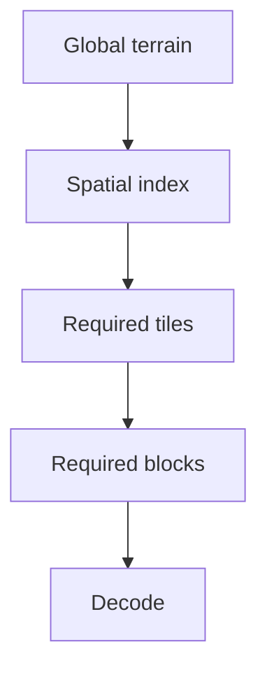

Large independently decodable units, or **superblocks**, provide a compromise
between compression efficiency and random access.

Within a superblock, smaller adaptive blocks can share models and state.
Across superblocks, decoding remains independent.

### 6.3 Decoder Pipeline

The decoder is the inverse of the encoder:

```mermaid
flowchart TD
    S[XTM Stream] --> H[Read header / index]
    H --> L[Locate required superblocks]
    L --> E[Entropy decode]
    E --> SR[Symbol reconstruction]
    SR --> IW[Inverse wavelet transform]
    IW --> IR[Inverse residual transform]
    IR --> PR[Predictor reconstruction]
    PR --> CS[Canonical samples]
    CS --> IS[Inverse scale (if required)]
    IS --> OT[Output Terrain]
```

The decoder should ultimately support both full tile and regional decoding:

```cpp
// Full decode
auto full = xtm::api::decode_file("terrain.xtm", "terrain.tif");

// Region decode
xtm::api::DecodeOptions opts;
opts.region_x = 0;
opts.region_y = 0;
opts.region_width = 512;
opts.region_height = 512;
auto roi = xtm::api::decode_file("terrain.xtm", "roi.tif", opts);
```

The latter is essential for large terrain datasets.

### 6.4 Cross-Tile Prediction (Future)

Adjacent 1° tiles describe a continuous terrain surface. Their boundaries are
strongly correlated. Future versions may exploit this redundancy.

However, arbitrary dependency chains such as:


would damage random access. Cross-tile prediction should therefore be
investigated at the region/superblock level while maintaining bounded
decoding dependencies.

This is a later optimization and is not required for the initial codec.

### 6.5 Multiresolution Terrain (Future)

XTM should eventually support terrain at multiple levels of detail.

This enables:

- Global rendering
- Regional rendering
- Local detailed terrain
- Reduced I/O
- Fast previews
- Terrain streaming

Conceptually:

```mermaid
flowchart TD
    W[World] --> C0[Coarse terrain (LOD 0)]
    W --> C1[Medium terrain (LOD 1)]
    W --> C2[Full-resolution terrain (LOD 2)]
```

A multiresolution representation may eventually integrate naturally with the
wavelet hierarchy rather than storing independent raster pyramids. This
requires further research.

---

## 7. Analysis & Quality

### 7.1 xtm analyze Command

The first development tool is the terrain analyzer.

**Usage:**

```bash
xtm analyze Copernicus_DSM_COG_10_N27_00_E086_00_DEM.tif
```

**Output report format:**

```text
SOURCE METADATA
  Dimensions:               3600 x 3600
  Samples:                  12,960,000
  Sample type:              Float32
  Raw size:                 51.84 MB
  Compressed source size:   38.42 MB
  CRS:                      EPSG:4326
  Resolution:               0.000277778 deg (~30 m)

ELEVATION STATISTICS
  Minimum:                  210.50 m
  Maximum:                  8848.86 m
  Mean:                     4231.45 m
  Std Dev:                  1120.30 m
  Unique values:            8,432,109
  Shannon Entropy:          18.42 bits/sample

FLOAT PRECISION
  Fractional distribution:  [... breakdown ...]
  Float32 bit structure:    [... breakdown ...]
  Effective precision:      0.01 m
  Quantization error:       0.002 m

SPATIAL DIFFERENCES
  ΔX entropy:               7.84 bits/sample
  ΔY entropy:               7.91 bits/sample
  Second-diff entropy:      6.12 bits/sample
  Gradient distribution:    [... breakdown ...]
  Local variance:           [... breakdown ...]

PREDICTOR PERFORMANCE (ENTROPY)
  Left:                     7.84 bits/sample
  Above:                    7.91 bits/sample
  Average:                  7.20 bits/sample
  Gradient:                 6.12 bits/sample
  JPEG-LS:                  5.95 bits/sample
  Plane:                    5.80 bits/sample

TRANSFORM PERFORMANCE
  None:                     5.80 bits/sample
  Wavelet L1:               4.90 bits/sample
  Wavelet L2:               4.45 bits/sample
  Wavelet L3:               4.20 bits/sample

COMPRESSION RESULTS SUMMARY
  Raw Float32 size:         51.84 MB
  Original GeoTIFF size:    38.42 MB
  XTM compressed size:      18.20 MB
  Bitrate:                  3.85 bits/sample
  Compression Ratio:        2.85:1 vs Raw (2.11:1 vs GeoTIFF)
  Encode Throughput:        145.2 MB/s
  Decode Throughput:        410.8 MB/s
```

### 7.2 Precision Analysis

The analyzer evaluates multiple vertical precisions:

- 0.01 m
- 0.10 m
- 0.25 m
- 0.50 m
- 1.00 m
- 2.00 m
- 5.00 m

For each precision, measure:

- Compressed size
- `bits/sample`

This produces a terrain-specific precision-vs-size curve.

### 7.3 Adaptive Precision (Future Direction)

Precision could eventually vary spatially across a tile:

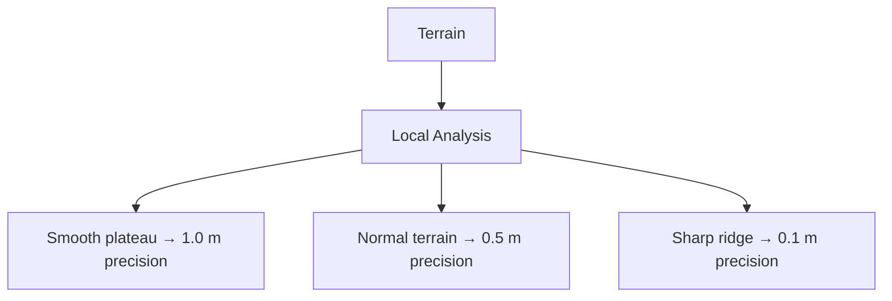

The objective is to select the coarsest representation satisfying the codec's
documented quantization bound ($|z - \hat{z}| \le q/2$).

This makes XTM an error-bounded terrain codec rather than simply a quantized
raster format.

---

## 8. Targets & Benchmarking

### 8.1 Compression Target

An early goal was compressing the global Copernicus DEM dataset to below
~10 GB. This remains a useful headline benchmark, but is **not a strict
design requirement**.

A format that compresses the global dataset to 20–40 GB while offering:

- Fast CPU decoding
- High-performance random access
- Native multiresolution streaming
- Predictable error bounds
- Clean C++/Python integration

is substantially more useful than a 10 GB file optimized purely for archive
size.

Optimization optimizes a composite utility function:

$$\text{Utility} = f(\text{compression}, \text{decodeSpeed}, \text{randomAccess}, \text{quality}, \text{complexity})$$

### 8.2 Scale of Regional Datasets

One GLO-30 tile covers:

$$\sim 10,000\text{--}12,000\text{ km}^2$$

depending on latitude. At Himalayan latitude (~27.5° N):

$$\sim 111\text{ km} \times \sim 99\text{ km}$$

The Himalayan region requires ~80–120 tiles. At ~52 MB raw elevation data per
tile, 100 tiles correspond to:

$$\sim 5.2\text{ GB uncompressed Float32 data}$$

India-scale coverage spans several hundred tiles (~20–40 GB raw). This makes
regional datasets practical targets for local high-performance XTM storage
and experimentation.

### 8.3 Benchmark Philosophy

Every optimization must answer:

> *How many bits did this feature save, and what did it cost?*

**Primary metric:**

- `bits/sample`

**Secondary metrics:**

- Compression ratio
- Total compressed bytes
- Encode throughput (MB/s)
- Decode throughput (MB/s)
- Peak RAM usage
- Random-access latency