# libxtm Compression Pipeline — Comprehensive Technical Reference

This document is the authoritative walkthrough of libxtm's end-to-end pipeline: how a raw GeoTIFF becomes a `.xtm` file, how a `.xtm` file becomes a GeoTIFF again (including region-of-interest queries), and how `xtm analyze` instruments the pipeline. It documents the actual implementation (commit `c2a27de`), not the aspirational spec in `libxtm_spec.md`.

---

## 1. System Map

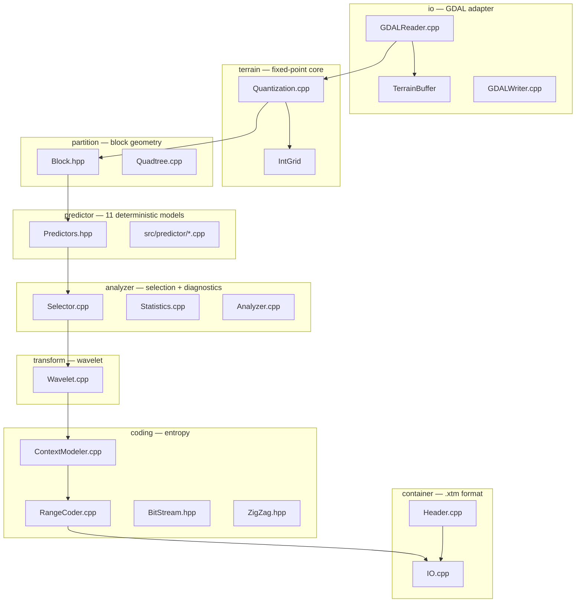

| Module | Files | Responsibility |
|---|---|---|
| `io` | `GDALReader.cpp`, `GDALWriter.cpp` | Ingest/export via GDAL; adapter layer only |
| `terrain` | `Quantization.cpp`, `Terrain.hpp` | Float32 → fixed-point `IntGrid` conversion, NoData inpainting |
| `partition` | `Quadtree.cpp`, `Block.hpp` | Block views + recursive cost-driven quadtree splitting |
| `predictor` | `Predictors.hpp`, `src/predictor/*.cpp` | 11 deterministic predictors, encode/decode pairs |
| `analyzer` | `Selector.cpp`, `Analyzer.cpp`, `Statistics.cpp` | Per-block predictor selection + full diagnostic report |
| `transform` | `Wavelet.cpp` | Reversible integer CDF 5/3 lifting wavelet (2D, up to 3 levels) |
| `coding` | `RangeCoder.cpp`, `ContextModeler.cpp`, `BitStream.hpp`, `ZigZag.hpp` | Symbol modeling + adaptive arithmetic coding |
| `container` | `Header.cpp`, `IO.cpp` | Binary `.xtm` format, block index, CRC32 |

The CLI (`apps/xtm/`) currently **contains the pipeline orchestration itself** (`EncodeCmd.cpp`, `DecodeCmd.cpp`) — there is no library-level `Encoder`/`Decoder` class. The analyzer (`Analyzer.cpp`) re-implements a third copy of the same stage sequence for its statistics.

---

## 2. The Encoder Pipeline

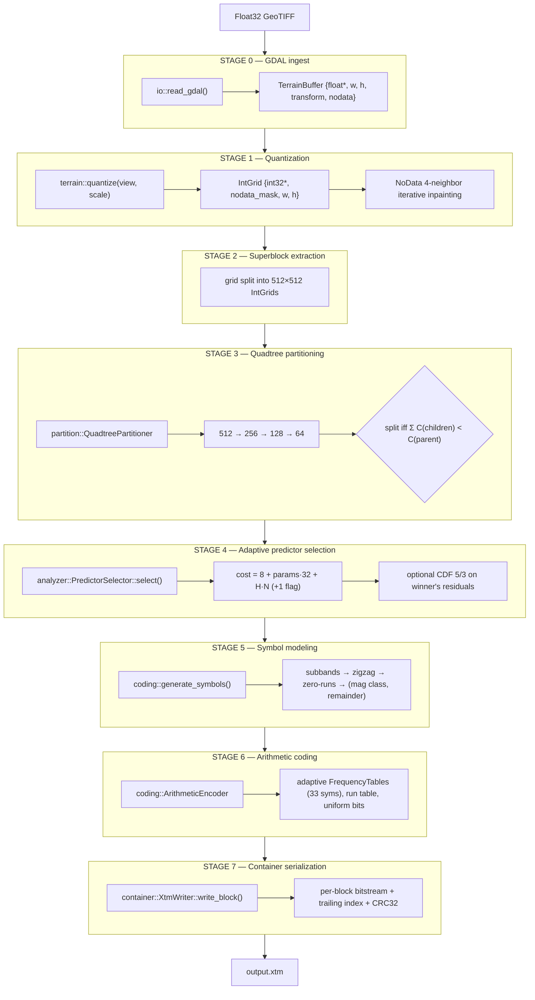

The stages run **per 512×512 superblock in parallel** (one worker thread per CPU core); stages 3–6 run per quadtree leaf block within a superblock, sequentially.

---

## 3. Stage-by-Stage Detail

### Stage 0 — GDAL Ingest (`src/io/GDALReader.cpp`)

- Opens the dataset with `GDALOpen(path, GA_ReadOnly)`, reads **band 1 only**, always as `GDT_Float32` via `RasterIO`.
- Copies the 6-element geotransform into `GeoTransform {origin_x, pixel_width, rotation_x, origin_y, rotation_y, pixel_height}` (rotations are read but **never propagated** into the container).
- Captures `NoDataValue` (if present) as `std::optional<float>`.
- **Does not read the projection/CRS** — `header.epsg_crs` is therefore always `0` on encode (see review §2.1).

### Stage 1 — Quantization (`src/terrain/Quantization.cpp`)

```cpp
grid.data[idx] = int32(std::round(val * (1.0 / scale)));
```

- All downstream stages operate on `IntGrid {std::vector<int32_t> data, std::vector<bool> nodata_mask, w, h}`.
- NoData pixels are zeroed in `data` and flagged in `nodata_mask`, then filled by a **bounded iterative 4-neighbor average inpainting** loop (a multi-pass diffusion; each pass fills pixels adjacent to already-filled ones). The inpainting exists so predictors never see cliffs; the original mask is serialized per block instead.
- The reconstruction bound is `|z − ẑ| ≤ scale/2`. There is **no true Float32-lossless mode**; `--scale 1.0` is meter precision, not bit-exact.

### Stage 2 — Superblock Extraction

- The global grid is tiled into 512×512 superblocks (edge blocks are truncated to the grid bounds).
- Superblocks are the **independence unit**: predictors never read across a superblock boundary, which is what enables ROI decoding.
- A worker pool (`std::thread::hardware_concurrency()` workers) consumes superblock indices via `std::atomic<uint32_t> next_superblock_idx`.

### Stage 3 — Quadtree Partitioning (`src/partition/Quadtree.cpp`)

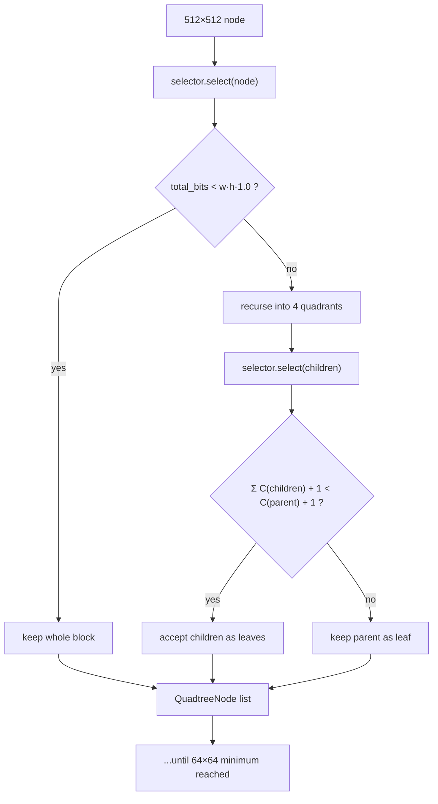

- Each superblock starts as one 512×512 node and is recursively subdivided down to a 64×64 minimum.
- **Split rule:** a node splits into 4 children only when

  ```
  Σ C(children) + 1 bit (split flag) < C(parent) + 1 bit
  ```

  where `C` comes from the selector (Stage 4). Both sides carry the same 1-bit flag cost, so it cancels — but it is bookkept on every node.
- **Early-out heuristics:**
  - blocks at or below `min_block_size` are leaves;
  - blocks with `total_bits < width·height·1.0` (i.e. < 1 bit/sample) are kept whole — an implicit "already compressible" test.
- The returned `QuadtreeNode {block, selection, is_split}` set becomes the block list; note `is_split` is never actually serialized (the decoder re-derives block geometry from the index entries, which store x/y/w/h directly).

### Stage 4 — Adaptive Predictor Selection (`src/analyzer/Selector.cpp`)

**Candidate cost model** (identical in analyzer, encoder, and quadtree):

```text
C(P) = C_id     + C_params       + C_residual
     = 8 bits      params·32 bits   H(residuals) · N
```

`H(residuals)` is the empirical Shannon entropy of the residuals (bits/sample) computed by sorting a copy of the residual vector; `N` = block sample count. The winner is `P* = argmin C(P)`.

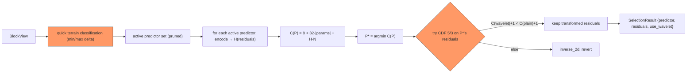

**Quick terrain classification** prunes the candidate set before evaluation:

| Condition (int32 delta = max−min) | Active predictors |
|---|---|
| `delta == 0` (perfectly flat) | Average, Left, Above only |
| `delta > 200` (very noisy) | all except Plane, JPEG-LS |
| otherwise | all 11 |

Classification is done by **string comparison on `name()`** — see review §3.3.

**Two pipeline orders** (selected by `--pipeline`):

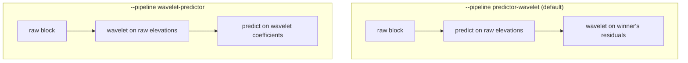

1. **`PredictorWavelet` (default):** evaluate all active predictors on the raw block → pick the winner → apply `forward_2d` CDF 5/3 to the *winner's residuals* → if `C(wavelet) + 1 flag bit < C(no wavelet) + 1 flag bit`, keep the transformed residuals (`use_wavelet = true`), else `inverse_2d` to revert and leave `use_wavelet = false`. The decision is **per block**.
2. **`WaveletPredictor`:** wavelet-transform the whole block first, then predict on the coefficients. Requires the decoder's special `FLAG_WAVELET_FIRST` path (§4).

`max_levels` for the wavelet is derived from block size (`min(w,h) ≥ 2^levels`, max 3) — a derivation **duplicated** in `Selector.cpp`, `Analyzer.cpp`, and `DecodeCmd.cpp` (see review §2.4). Only the 1-bit `use_wavelet` flag is serialized; the decoder recomputes the same `max_levels`.

**Note on the selector's pruning:** the parameter `early_exit_threshold` (default 10.0) is stored but never used — the historical "early exit" bug was removed, leaving the parameter dead.

### Stage 5 — Symbol Modeling (`src/coding/ContextModeler.cpp`)

The residual/coefficient block is turned into a serialized symbol stream:

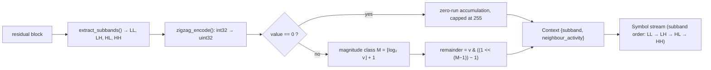

1. **Subband classification** — `extract_subbands()` maps each (x, y) to LL/LH/HL/HH given `max_levels`. Coefficients are then processed **subband by subband** (LL → LH → HL → HH), which is what makes the decode side deterministic.
2. **ZigZag** — signed int32 → unsigned (`0, −1, +1, −2, +2… → 0, 1, 2, 3, 4…`) via `zigzag_encode`.
3. **Zero runs** — within each subband, consecutive zeros collapse into one `{magnitude_class = 0, run_length}` symbol, capped at 255 per symbol.
4. **Magnitude classes** — a nonzero zigzag value `v` becomes `{magnitude_class = M, remainder}` where `M = ⌊log₂ v⌋ + 1` (0..32) and `remainder = v & ((1 << (M−1)) − 1)`.
5. **Contexts** — each symbol carries `Context {subband, neighbour_activity}`. In `Extended` model, `neighbour_activity` is 1 if the previous sample in the same subband had `|v| > 2`; in `Simple` it is always 0 (context = subband only).

### Stage 6 — Entropy Coding (`src/coding/RangeCoder.cpp`, `BitStream.hpp`)

- A 32-bit carry-less **arithmetic coder** (`ArithmeticEncoder`/`ArithmeticDecoder`, Schindler-style renormalization with `pending_bits_`).
- Per-context adaptive `FrequencyTable(33)` (symbols 0..32), lazily created per block via `std::unordered_map<Context, FrequencyTable>`; frequencies halve when total ≥ 16384 (floor at 1) to prevent 32-bit overflow.
- `magnitude_class == 0` → the run length is encoded (`run_length − 1`) into a shared `FrequencyTable(256)`.
- `magnitude_class > 1` → the `M − 1` remainder bits are coded with a fixed uniform `FrequencyTable(2)` (bypass coding, ≈1 bit/bit).
- Decoder uses **binary search** on the cumulative table, keeping symbol lookup O(log 33).


### Stage 7 — Container Serialization (`src/container/Header.cpp`, `IO.cpp`)

**Per-block bitstream layout** (written by `EncodeCmd.cpp`, read by `DecodeCmd.cpp`):

| Field | Bits | Notes |
|---|---|---|
| predictor index | 8 | index into `PredictorBank::ordered()` (11 entries) |
| use_wavelet flag | 1 | |
| parameter count | 8 | |
| parameters | 32 each | fixed-point int32 params (Plane/LeastSquares) |
| block has nodata | 1 | |
| nodata mask (RLE) | 8 per run | runs chunked at 255 → (255, 0) pairs |
| magnitude-class symbols | variable | arithmetic-coded |
| run lengths | variable | arithmetic-coded, when M = 0 |
| remainder bits | variable | uniform-coded, when M > 1 |

**File layout:**

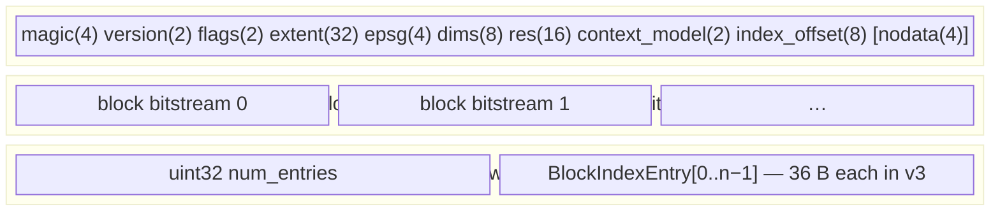

```text
┌────────────────────────────────────────────┐
│ XtmHeader (78/82 B)  ← placeholder written │
│                      first, rewritten at   │
│                      finalize() with the   │
│                      real index_offset     │
├────────────────────────────────────────────┤
│ block bitstream 0                          │
│ block bitstream 1                          │  ← appended in worker-
│ …                                          │     completion order
├────────────────────────────────────────────┤
│ uint32 num_entries                         │
│ BlockIndexEntry[0..n−1]  (36 B each, v3)   │
└────────────────────────────────────────────┘
```

`BlockIndexEntry` = `{block_x, block_y, block_width, block_height, byte_offset, byte_length, crc32}`.

**`XtmHeader` fields:** magic `XTM\0`, version (2 = +context_model, 3 = +CRC32), flags (`FLAG_USE_WAVELET` unused by codec decision — the per-block flag is used instead; `FLAG_HAS_NODATA`; `FLAG_WAVELET_FIRST`), `context_model` (0=Simple, 1=Extended), `nodata_value`, extent `(min_x, min_y, max_x, max_y)`, `epsg_crs` (always 0 today — see review §2.1), `grid_width/height`, `res_x/res_y` (the scale), `index_offset`.

`XtmWriter` is thread-safe (`write_mutex_`); blocks land on disk in worker-completion order, so **byte offsets vary between runs** (see review §2.6). `finalize()` seeks back and rewrites the header with the true `index_offset`.

---

## 4. The Decoder Pipeline

```mermaid
flowchart TB
    X["input.xtm"] --> H["read header + validate<br/>magic · version 2..3 · context_model ≤ 1<br/>index_offset within file · index size within file"]
    H --> ROI{"--region x y w h ?"}
    ROI -- no --> ROI2["full grid: rw = grid_width, rh = grid_height"]
    ROI -- yes --> ROI2
    ROI2 --> SBX["compute intersecting superblock range"]
    SBX --> WORK["for each intersecting superblock (parallel):"]

    subgraph SB["per superblock"]
        direction TB
        W1["filter index entries inside superblock, sort by (y, x)"]
        W2["for each block:"]
        W3["read bitstream → CRC32 check"]
        W4["BitReader: predictor idx (validated < 11) · wavelet flag · params · nodata RLE"]
        W5["ArithmeticDecoder: per-subband magnitude classes + run lengths + remainder bits<br/>(max_levels recomputed from block dims)"]
        W6{"use_wavelet ?"}
        W6 -- yes --> W7["inverse_2d on residuals"]
        W6 -- no --> W8
        W7 --> W8["predictor->decode → writes into superblock grid"]
        W8 --> W9{"FLAG_WAVELET_FIRST ?"}
        W9 -- yes --> W10["decode via local grid → inverse_2d → copy into superblock grid"]
        W1 --> W2 --> W3 --> W4 --> W5 --> W6
    end

    WORK --> SB --> MERGE["copy superblock pixels intersecting ROI into roi_grid"]
    MERGE --> DQ["dequantize (int × scale, re-apply nodata_value)"]
    DQ --> OUT["write GeoTIFF (DEFLATE · PREDICTOR=3 · TILED)"]
```

Key properties:

- **ROI decoding:** only superblocks intersecting `[rx, rx+rw) × [ry, ry+rh)` are touched; per-superblock work is identical to a full decode. The `--region` flag is the only geometry-adaptive part.
- **Determinism:** the decoder is fully deterministic given the file — it never depends on encode thread scheduling because the index supplies (x, y, w, h) and byte offsets.
- **Silent-corruption guards:** header magic/version/context-model checks, index-region bounds check, per-block CRC32, predictor-index validation. Remaining unguarded: `PlanePredictor::decode` trusts `parameters.size()` (review §2.3), and `BitReader` returns 0s past EOF (review §2.5).

---

## 5. The Analyzer Pipeline (`src/analyzer/Analyzer.cpp`)

`xtm analyze` runs the **same stages as the encoder**, but instrumented, per superblock:

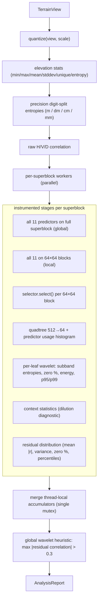

1. **Elevation stats** — min/max/mean/stddev/unique-count/Shannon entropy on Float32 (NoData-excluded).
2. **Precision analysis** — digit-split entropies of the quantized grid (meter/decimeter/centimeter/millimeter planes) for `scale ∈ {1, 0.1, 0.01, 0.001}`.
3. **Raw correlation** — Pearson H/V/D correlation of the quantized grid.
4. **Global predictors** — all 11 predictors encode the full superblock (so "global" = per-superblock aggregates); 64×64-block variants also run per superblock.
5. **Adaptive block-64 entropy** — `selector.select()` on each 64×64 block.
6. **Quadtree entropy** — `QuadtreePartitioner::partition(superblock, 512, 64)`; leaf usage histogram + predictor usage percentages + mean |residual| per predictor.
7. **Wavelet instrumentation** — per leaf: `forward_2d` on the winner's residuals, then subband counts, zero percentages, entropies, mean magnitudes, variance, energy share, p95/p99 coefficients, zero-run lengths.
8. **Context statistics** — unique contexts/block, symbols per context, context size distribution (the context-dilution diagnostic).
9. **Residual distribution** — mean |r|, variance, zero %, median/p95/p99/max (global Gradient predictor).
10. **Correlation of residuals** — feeds the global wavelet heuristic `use_wavelet iff max(|corr_H|,|corr_V|,|corr_D|) > 0.3`.
11. **Difficulty & confidence** — per-block entropy buckets (easy < 3, medium 3–7, hard > 7) and |r| ≤ {0,1,2,5,10} percentages.

All accumulators are thread-local inside the worker lambda and merged under a single mutex (the "monolith" — review §3.2). Entropy estimates of the coding stage (`dwt_quadtree_entropy`) use per-context-*unconditional* magnitude-class entropy × symbol count + remainder bits + run bits — an estimate, not the adaptive coder's real output.

---

## 6. The Rate-Cost Model (the "why" behind every decision)

Everything adaptive is driven by one principle — *minimize estimated encoded bits*:

| Decision | Criterion |
|---|---|
| Predictor choice | `C(P) = 8 + 32·|params| + H(residuals)·N` |
| Wavelet on/off | `C(wavelet) + 1 < C(plain) + 1` (flag cost cancels) |
| Quadtree split | `Σ₄ C(children) + 1 < C(parent) + 1` |
| Global wavelet heuristic (analyze only) | `max residual correlation > 0.3` |

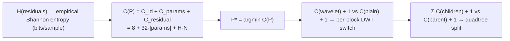

The `+1` flag and `8`-bit ID costs are what prevent gratuitous per-block adaptivity; the quadtree's per-node 1-bit cost is what stopped over-splitting in the Phase V5 validation (10.19 vs 10.18 bpp).

---

## 7. Threading & Memory Model

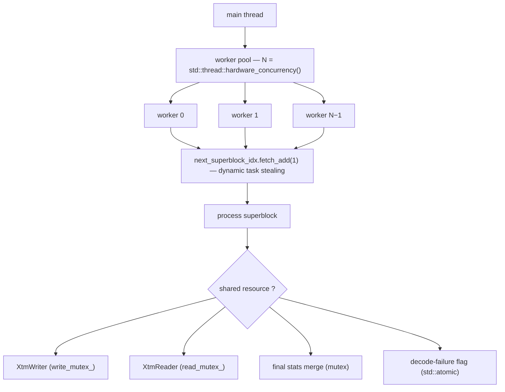

- **Encode/Decode/Analyze:** N workers = `std::thread::hardware_concurrency()`, dynamic task stealing via `fetch_add` on a superblock index. Each worker owns its `PredictorBank` and (in encode) a local stats accumulator.
- **Shared state:** `XtmWriter` (mutexed), `XtmReader` (mutexed), final stats merge (mutexed), decode-failure flag (`std::atomic<bool>`).
- **Scratch:** wavelet `forward_1d` receives a caller-owned `scratch` vector reused across all rows/cols of one block (`Wavelet.cpp`); predictor `encode()` still allocates fresh residual vectors per call (review §3.6).
- **Peak RAM (analyze):** ~1 GB+ for a 3600×3600 tile in the worst case — dominated by 22 per-thread residual histograms (`std::unordered_map`) and the full-tile grid copies (review §3.7).

---

## 8. Lockstep Invariants (must never drift)

These pairs must stay bit-for-bit identical or the codec silently corrupts data:

| Invariant | Where duplicated |
|---|---|
| Predictor order / IDs (index 0 = Gradient, …) | `PredictorBank::ordered()` — single source, but 8-bit IDs are positional; adding a predictor breaks old files |
| Subband coordinate mapping | `coding::extract_subbands()` — shared (fixed in prior review) |
| `max_levels` from block dims | `Selector.cpp:78`, `Analyzer.cpp:336`, `DecodeCmd.cpp:195` — **3 copies** |
| Context definition + model (Simple/Extended) | `ContextModeler.cpp` (encode) vs `DecodeCmd.cpp` (decode) — model ID persisted in header since v2 |
| Zero-run cap (255), magnitude-class max (32), remainder bypass | `generate_symbols()` vs `DecodeCmd.cpp` |
| Predictor encode formula == decode formula | per-predictor `encode()`/`decode()` pairs |
| Wavelet forward == inverse | `CDF53Transform` (round-trip tested) |
| Quantize scale ↔ dequantize scale | `quantize`/`dequantize` + `header.res_x` |

---

## 9. Key Constants

| Constant | Value | Location |
|---|---|---|
| Superblock size | 512 | EncodeCmd/DecodeCmd/Analyzer |
| Quadtree min block | 64 | QuadtreePartitioner callers |
| Quadtree max block | 512 | QuadtreePartitioner callers |
| Wavelet levels | ≤ 3 | derived from dims |
| Predictor ID bits | 8 | bitstream |
| Parameter bits | 32 | bitstream |
| Magnitude classes | 33 (0..32) | FrequencyTable(33) |
| Zero-run cap | 255 | generate_symbols |
| Frequency rescale threshold | 16384 | FrequencyTable::increment |
| Noise-class delta | 200 | Selector quick classification |
| Wavelet correlation threshold | 0.3 | Analyzer heuristic |
| Header format version | 3 (2 = context model, 3 = CRC32) | Header.hpp |

---

## 10. File Format Summary (v3)

| Section | Bytes | Content |
|---|---|---|
| Header | 78 (82 if NoData) | magic(4) version(2) flags(2) extent(32) epsg(4) dims(8) res(16) context_model(2) index_offset(8) [nodata(4)] |
| Block payloads | variable | one bitstream per quadtree leaf (see §3 Stage 7) |
| Index | 4 + 36·n | entry count + per-block `{x,y,w,h,offset,length,crc32}` |
| Header re-write | — | `index_offset` patched at `finalize()` |

Checksums (CRC32) exist per block (v3) and are verified on read; there is no whole-file checksum or header checksum.

---

## 11. Relationship to the Docs

- **`libxtm_spec.md`** — target architecture. Current gaps: no `Encoder/Decoder` classes, no rANS (range coder used), no lossless-Float32 mode, no Python bindings, no multiresolution, `xtm benchmark` CLI missing.
- **`libxtm_dev.md`** — phase plan (V0–V12). Implemented through V10 (random access); V11 (CUDA) and V12 (pyramids, adaptive precision) are planned.
- **`walkthrough.md`** — historical phase log; ends at V10.5 + build modernization.
- **`benchmark_analysis.md`** — 40-tile A/B benchmark vs GDAL DEFLATE/ZSTD at scale 0.01; XTM averages 7.89 bits/sample vs 13.11 (ZSTD), ≈ −40% at ~7–13 s/tile encode.
