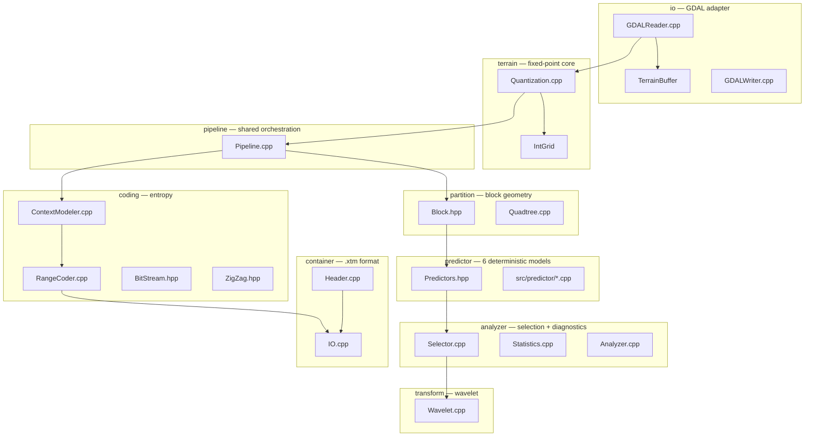
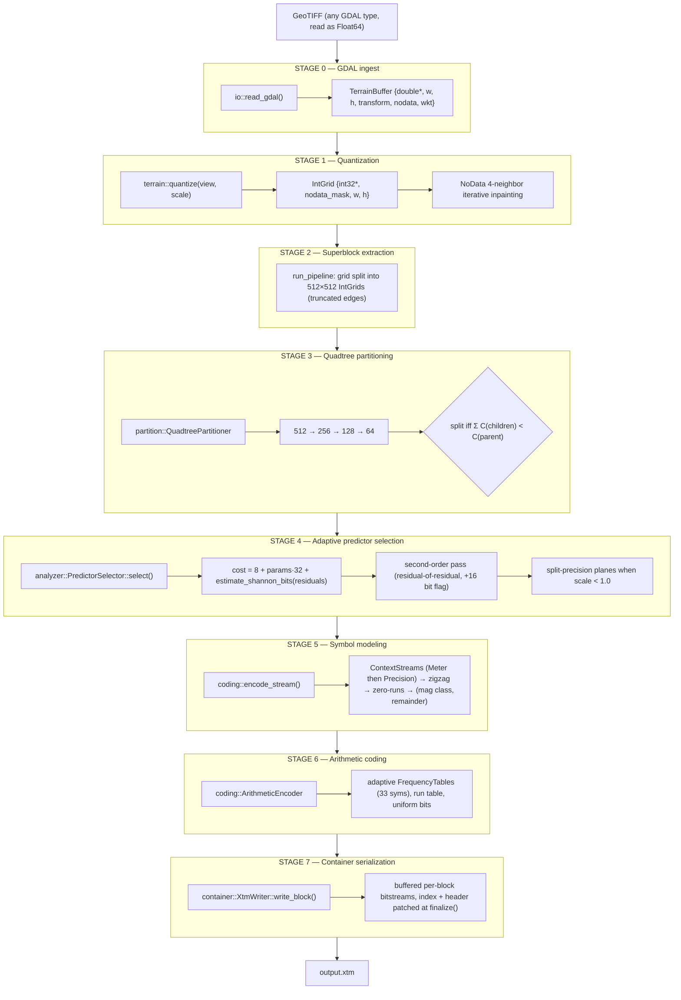
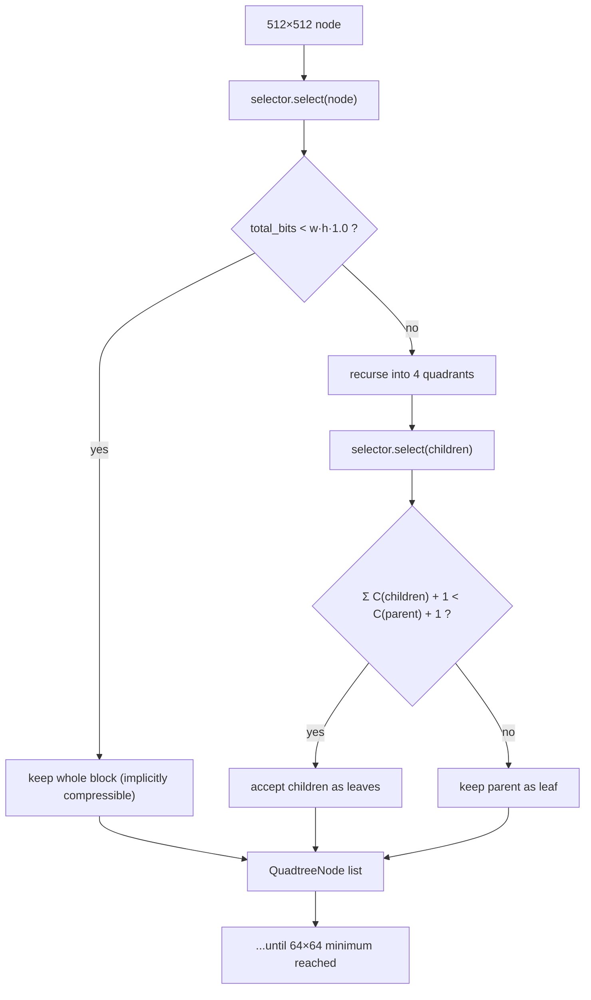
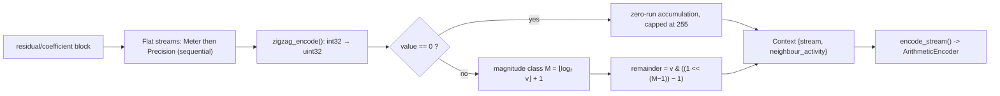
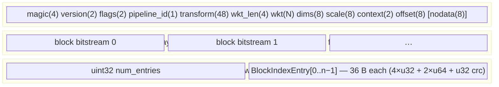
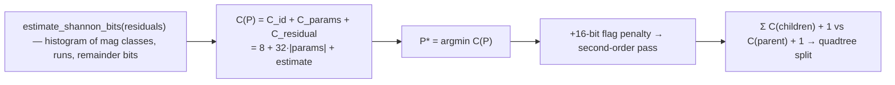
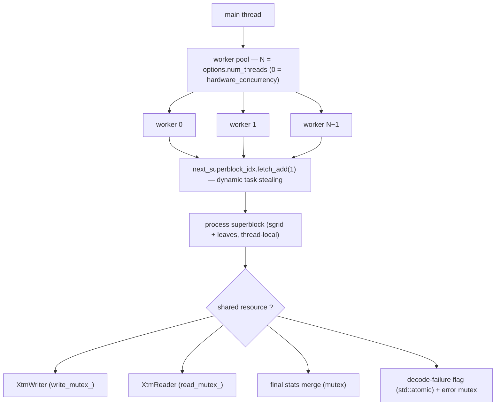

# libxtm Compression Pipeline — Comprehensive Technical Reference

This document is the authoritative walkthrough of libxtm's end-to-end pipeline: how a raw GeoTIFF becomes a `.xtm` file, how a `.xtm` file becomes a GeoTIFF again (including region-of-interest queries), and how `xtm analyze` instruments the pipeline. It documents the **current implementation** (v0.1.0). If the code and this document ever disagree, the code wins — the public headers under `include/xtm/` are the source of truth.

---

## 1. System Map



| Module | Files | Responsibility |
|---|---|---|
| `io` | `GDALReader.cpp`, `GDALWriter.cpp` | Ingest/export via GDAL; adapter layer only |
| `terrain` | `Quantization.cpp`, `Terrain.hpp` | Float64 → fixed-point `IntGrid` conversion, NoData inpainting |
| `partition` | `Quadtree.cpp`, `Block.hpp` | Block views + recursive cost-driven quadtree splitting |
| `predictor` | `Predictors.hpp`, `src/predictor/*.cpp` | 6 deterministic predictors, encode/decode pairs |
| `analyzer` | `Selector.cpp`, `Analyzer.cpp`, `Statistics.cpp` | Per-block predictor selection + full diagnostic report |
| `transform` | `Wavelet.cpp` | Reversible integer CDF 5/3 lifting wavelet (2D, up to 3 levels) |
| `pipeline` | `Pipeline.cpp` | Shared 512×512 superblock worker pool (`run_pipeline`) |
| `coding` | `RangeCoder.cpp`, `ContextModeler.cpp`, `BitStream.hpp`, `ZigZag.hpp` | Symbol modeling + adaptive arithmetic coding |
| `container` | `Header.cpp`, `IO.cpp` | Binary `.xtm` format, block index, CRC32 |

The core orchestration is split into two layers:

- **`coding::run_pipeline` (`src/coding/Pipeline.cpp`)** owns the 512×512 superblock slicing, the parallel worker pool, and the quadtree/fixed-block partitioning with predictor selection. **Both** the encoder (`src/coding/Encoder.cpp`) and the analyzer (`src/analyzer/Analyzer.cpp`) are thin callbacks over this single shared implementation.
- **`XtmEncoder` / `XtmDecoder`** (`src/coding/Encoder.cpp`, `Decoder.cpp`) perform the actual bitstream coding on the partitioned blocks.

The CLI (`apps/xtm/`, commands `encode`/`decode`/`analyze`/`info`/`verify`) merely wraps these library-level classes for file/GDAL orchestration.

---

## 2. The Encoder Pipeline



The stages run **per 512×512 superblock in parallel** (one worker thread per core, `run_pipeline`); stages 3–7 run per quadtree leaf block within a superblock.

---

## 3. Stage-by-Stage Detail

### Stage 0 — GDAL Ingest (`src/io/GDALReader.cpp`)

- Opens the dataset with `GDALOpen(path, GA_ReadOnly)`, reads **band 1 only**, always as `GDT_Float64` via `RasterIO` to prevent any truncation.
- Copies the complete 6-element GDAL affine geotransform into `GeoTransform {origin_x, pixel_width, rotation_x, origin_y, rotation_y, pixel_height}`, fully supporting rotated/sheared rasters.
- Captures `NoDataValue` (if present) as `std::optional<double>`.
- Reads the precise projection/CRS via `GetProjectionRef()` and stores the raw WKT string into `wkt_projection`.

### Stage 1 — Quantization (`src/terrain/Quantization.cpp`)

```cpp
grid.data[idx] = int32(std::round(val * (1.0 / scale)));
```

- All downstream stages operate on `IntGrid {std::vector<int32_t> data, std::vector<uint8_t> nodata_mask, w, h}`.
- NoData pixels are zeroed in `data` and flagged in `nodata_mask`, then filled by an **iterative 4-neighbor average inpainting** loop (multi-pass diffusion; each pass fills pixels adjacent to already-filled ones). The inpainting exists so predictors never see cliffs; the original mask is serialized per block instead.
- The reconstruction bound is `|z − ẑ| ≤ scale/2`. There is **no true Float32-lossless mode**; `--scale 1.0` is meter precision, not bit-exact.

### Stage 2 — Superblock Extraction (`src/coding/Pipeline.cpp`)

- The global grid is tiled into 512×512 superblocks via `coding::run_pipeline(grid, options, selector, callback)`.
- **Truncated Boundary Blocks:** Edge blocks are dynamically truncated to exactly fit the grid bounds without any padding (e.g. a grid of width 3600 will produce a final edge superblock of exactly 16×512). This preserves compression efficiency by avoiding padded "junk" pixels.
- Superblocks are the **independence unit**: predictors never read across a superblock boundary, which is what enables ROI decoding.
- A worker pool consumes superblock indices via `std::atomic<uint32_t> next_superblock_idx` (dynamic task stealing). Each worker owns its **copy** of the `PredictorSelector` (so its mutable scratch buffers are thread-local), its own 512×512 `sgrid` buffer, and a reusable leaf vector; the callback is invoked once per superblock with `(sgrid, sx, sy, leaves, quad_bits)`.

### Stage 3 — Quadtree Partitioning (`src/partition/Quadtree.cpp`)



- Each superblock starts as one node (typically 512×512) and is recursively subdivided down to a 64×64 minimum.
- **Odd-Sized Boundaries:** If a truncated edge superblock is passed (e.g. 16×512), any axis already at or below `min_block_size` halts subdivision on that axis immediately (`width <= min_block_size || height <= min_block_size` → leaf), producing a single rectangular leaf (e.g. one 16×512 block) rather than subdividing the short axis.
- **Split rule:** a node splits into 4 children only when

  ```
  Σ C(children) + 1 bit (split flag) < C(parent) + 1 bit
  ```

  where `C` comes from the selector (Stage 4). Both sides carry the same 1-bit flag cost, so it cancels — but it is bookkept on every node.
- **Early-out heuristics:**
  - blocks at or below `min_block_size` are leaves;
  - blocks with `total_bits < width·height·1.0` (i.e. < 1 bit/sample) are kept whole — an implicit "already compressible" test.
- The returned `QuadtreeNode {block, selection}` set becomes the block list; the split flag is **never serialized** (the decoder re-derives block geometry from the index entries, which store x/y/w/h directly).
- **`--disable-quadtree`:** bypasses the quadtree entirely; the superblock is partitioned into fixed 64×64 blocks via `FixedGridPartitioner::partition`, each with `selector.select(b)`. Useful for A/B testing the quadtree's rate savings. The header records this via `FLAG_DISABLE_QUADTREE` (informational only; decoding is geometry-driven).

### Stage 4 — Adaptive Predictor Selection (`src/analyzer/Selector.cpp`)

**Candidate cost model** — identical in encoder, analyzer, and quadtree:

```text
C(P) = C_id     + C_params        + C_residual
     = 8 bits      params·32 bits    estimate_shannon_bits(residuals)
```

`estimate_shannon_bits` is a **single-pass histogram estimator**: it mimics the entropy coder's exact symbol model — zigzag magnitude classes (0..32), zero-run lengths (1..255, capped), and remainder bits — and returns the Shannon entropy of those streams plus the raw remainder-bit cost. **Selection cost does not run the arithmetic coder**; the estimator is an order of magnitude cheaper and its ranking agrees with a real arithmetic encode on normal terrain. The winner is `P* = argmin C(P)`.

```mermaid
flowchart LR
    B["BlockView"] --> SP{"scale < 1.0 ?"}
    SP -- yes --> SPLIT["split into meter (z/mult) + precision (z%mult) planes"]
    SPLIT --> CL
    SP -- no --> CL["quick terrain classification (min/max delta)"]
    CL --> ACT["active meter predictor set"]
    ACT --> EVAL["for each active predictor: encode → estimator cost"]
    EVAL --> SO["second-order pass: try residual of residuals<br/>(accept if sec_score + 16 bits < plain)"]
    SO --> COST["C(P) = 8 + 32·|params| + estimate"]
    COST --> WIN["M* = argmin C(P)"]
    WIN --> PREC["if split: P* = argmin over {Left, Gradient, Gap} on precision plane"]
    PREC --> OUT["SelectionResult {best_predictor, best_prec_predictor, use_second_order, best_encoded}"]
```



**Quick terrain classification** prunes the candidate set before evaluation:

| Condition (int32 delta = max−min) | Active predictors |
|---|---|
| `delta == 0` (perfectly flat) | Left only |
| `delta > 200` (very noisy) | all except Polynomial, JPEG-LS |
| otherwise | all 6 |

**Pipelines** (selected by `--pipeline`, stored in the header as `pipeline_id`):

- **`predictor` (default, `PIPELINE_PREDICTOR`)**: predictors run on raw elevations; the winner's residuals are serialized (see Stage 7 for the per-block header fields).
- **`wavelet` (`PIPELINE_WAVELET`)**: the CDF 5/3 forward transform is applied to the **whole block's elevations** first, then the transformed coefficients are serialized directly (no predictor IDs, no per-block DWT switch — the decoder recomputes `max_levels` from block dimensions via `coding::max_wavelet_levels`, max 3). This is the experimental legacy path; **it is only valid with `--scale >= 1.0`** (combining `--pipeline wavelet` with sub-meter scale is unsupported).

**Split-precision** (only when `scale < 1.0`, within either pipeline): the block is split into a meter plane (`z / multiplier`) and a precision plane (`z % multiplier`). The meter plane is predicted by the winner of the full candidate pool; the precision plane is predicted independently by the best of `{Left, Gradient, Gap}`. A `0xFF` precision-predictor ID marks "no precision plane" for that block.

**Second-order residual pass**: after the winning predictor, a residual-of-residual correction (prediction `p = W/2 + N/2` over the residual plane) is evaluated and accepted if its estimated cost plus the 16-bit flag penalty beats the plain residuals. When accepted, bit 7 of the serialized predictor ID (`0x80`) signals the decoder to reverse the pass.

### Stage 5 — Symbol Modeling (`src/coding/ContextModeler.cpp`)



1. **Context Streams** — The block is entirely encoded sequentially, one symbol at a time; no per-block symbol vectors are materialized. When split-precision applies (`has_precision`), the stream multiplexes `ContextStream::Meter` then `ContextStream::Precision` as two sequential flat streams within the single arithmetic-coded bitstream (the residual vector is `[meter (N samples), precision (N samples)]`).
2. **ZigZag** — signed int32 → unsigned (`0, −1, +1, −2, +2… → 0, 1, 2, 3, 4…`) via `zigzag_encode`.
3. **Zero runs** — within each stream, consecutive zeros collapse into one `{magnitude_class = 0, run_length}` symbol, capped at 255 per symbol.
4. **Magnitude classes** — a nonzero zigzag value `v` becomes `{magnitude_class = M, remainder}` where `M = ⌊log₂ v⌋ + 1` (0..32) and `remainder = v & ((1 << (M−1)) − 1)`.
5. **Contexts** — each symbol carries `Context {stream, neighbour_activity}`. In `Extended` model (CLI `--context extended`), `neighbour_activity` is 1 if the previous sample in the same stream had `|v| > 2`; in `Simple` (default) it is always 0 (context = stream only). There are thus up to 4 tables (2 streams × 2 activity levels).

### Stage 6 — Entropy Coding (`src/coding/RangeCoder.cpp`, `BitStream.hpp`)

- A classic Witten–Neal–Cleary **arithmetic coder** (`ArithmeticEncoder`/`ArithmeticDecoder`): 32-bit `low`/`high` interval state with `uint64_t` range math, underflow-carried `pending_bits_` renormalization, and a 32-bit `code_` window in the decoder.
- Per-context adaptive `FrequencyTable(33)` (symbols 0..32), sized per stream in `EncodingContext`; frequencies halve when the total reaches 16384 (floor at 1) to prevent overflow.
- `magnitude_class == 0` → the run length is encoded (`run_length − 1`) into a shared `FrequencyTable(256)`.
- `magnitude_class > 1` → the `M − 1` remainder bits are coded with a uniform `FrequencyTable(2)` (≈1 bit/bit).
- The decoder resolves symbols by **binary search** on the cumulative frequency table (O(log 33)).


### Stage 7 — Container Serialization (`src/container/Header.cpp`, `IO.cpp`)

**Per-block bitstream layout** (written by `XtmEncoder`, read by `XtmDecoder`):

| Field | Bits | Notes |
|---|---|---|
| predictor ID | 8 | `PredictorId` enum value; bit 7 (`0x80`) = second-order pass flag (predictor pipeline only) |
| precision predictor ID | 8 | only when `scale < 1.0`; `0xFF` = no split-precision |
| parameter count | 8 | |
| parameters | 32 each | fixed-point int32 params (Polynomial / LeastSquares) |
| block has nodata | 1 | |
| nodata mask (RLE) | 8 per run | runs chunked at 255 → (255, 0) pairs |
| residual stream | variable | arithmetic-coded magnitude classes + run lengths + remainder bits |

The `wavelet` pipeline omits the predictor fields entirely: the block payload is just the nodata bit + the arithmetic-coded coefficient stream.

**File layout** (v4):



```text
┌────────────────────────────────────────────┐
│ XtmHeader (variable) ← placeholder written │
│                      first, rewritten at   │
│                      finalize() with the   │
│                      real index_offset     │
├────────────────────────────────────────────┤
│ block bitstream 0                          │
│ block bitstream 1                          │  ← sorted by sequence_id =
│ …                                          │     (superblock_idx << 32) | leaf_idx
├────────────────────────────────────────────┤
│ uint32 num_entries                         │
│ BlockIndexEntry[0..n−1]  (36 B each)       │
└────────────────────────────────────────────┘
```

- **Deterministic ordering:** `XtmWriter::write_block` buffers each block's bitstream in memory (`pending_`), and `finalize()` sorts by `sequence_id` (superblock index · leaf index) before writing — the quadtree Z-order required for decoding, independent of worker scheduling. Note the trade-off: the **entire compressed file is buffered in RAM** until `finalize()`.
- **CRC32:** each payload is checksummed (v3+ format) and verified on read.
- **Header:** `magic "XTM\0"`, `version` (must be exactly 4), `flags`, `pipeline_id`, full 6-parameter `transform` (48 B), length-prefixed `wkt_projection`, `grid_width/height`, `scale` (double), `context_model` (0=Simple, 1=Extended), `index_offset`, and `nodata_value` (only when `FLAG_HAS_NODATA`).

| Flag | Value | Meaning |
|---|---|---|
| `FLAG_HAS_NODATA` | `1 << 1` | header carries `nodata_value` |
| `FLAG_DISABLE_QUADTREE` | `1 << 3` | encode used fixed 64×64 blocks (informational) |

---

## 4. The Decoder Pipeline

```mermaid
flowchart TB
    X["input.xtm"] --> H["read header + validate<br/>magic · version == 4 · context_model ≤ 1<br/>index offset within file · index size within file"]
    H --> ROI{"--region x y w h ?"}
    ROI -- no --> ROI2["full grid: rw = grid_width, rh = grid_height"]
    ROI -- yes --> ROI2
    ROI2 --> SBX["compute intersecting superblock range"]
    SBX --> WORK["for each intersecting superblock (parallel):"]

    subgraph SB["per superblock"]
        direction TB
        W1["filter index entries inside superblock (file order = Z-order, no sort)"]
        W2["for each block:"]
        W3["read bitstream → CRC32 check + bounds check"]
        W4["BitReader: predictor ID (validated) · second-order bit · precision predictor ID · params · nodata RLE"]
        W5["ArithmeticDecoder: per-context magnitude classes + run lengths + remainder bits<br/>(max_levels recomputed via coding::max_wavelet_levels)"]
        W6["second-order reversal if flagged → predictor->decode into superblock grid<br/>(SplitPrecisionWrapper when a precision predictor is present)"]
        W1 --> W2 --> W3 --> W4 --> W5 --> W6
    end

    WORK --> SB --> MERGE["copy superblock pixels intersecting ROI into roi_grid"]
    MERGE --> DQ["dequantize (int × scale, re-apply nodata_value)"]
    DQ --> OUT["write GeoTIFF (DEFLATE · PREDICTOR=3 · TILED, row by row)"]
```



Key properties:

- **ROI decoding:** only superblocks intersecting `[rx, rx+rw) × [ry, ry+rh)` are touched; per-superblock work is identical to a full decode. The `--region` flag is the only geometry-adaptive part. The output geotransform origin is shifted by the ROI offset (`origin_x += rx·pixel_width + ry·rotation_x`, `origin_y += rx·rotation_y + ry·pixel_height`) so the cropped TIFF is georeferenced correctly.
- **Determinism:** the decoder is fully deterministic given the file — it never depends on encode thread scheduling because the index supplies (x, y, w, h) and byte offsets, and payloads are laid out in Z-order at finalize.
- **Silent-corruption guards:** header magic/version/context-model checks, index-region and block-region bounds checks, per-block CRC32, predictor-id validation, and a bitstream underflow check on decode (excess bits past end-of-stream).
- **Pipelines:** everything is read back from the header — `context_model`, `scale` (→ split-precision), `pipeline_id` (predictor vs wavelet). The caller supplies only the ROI and thread count; there is no CLI knob to override the recorded model, since a mismatched model silently decodes to garbage.

---

## 5. The Analyzer Pipeline (`src/analyzer/Analyzer.cpp`)

`xtm analyze` runs the **same pipeline code as the encoder** — `analyze_terrain(view, scale, model, options)` drives `coding::run_pipeline` with the same `QuadtreePartitioner` and `PredictorSelector` — and instruments it per superblock through the callback. The reported entropy figures come from the same `estimate_shannon_bits` model used for selection, plus independent histogram entropies (`calculate_entropy`) for the per-predictor displays.

Report sections printed by `xtm analyze` (with `--wavelet` enabling the wavelet instrumentation):

1. **Dataset Overview** — dimensions, elevation min/max/mean/stddev, unique values, Shannon entropy (Float64, NoData-excluded).
2. **Spatial & Correlation Stats** — Pearson horizontal/vertical/diagonal correlation of the raw quantized grid and of Gradient residuals.
3. **Precision Analysis** — digit-split entropies of the quantized grid (meter/decimeter/centimeter/millimeter planes).
4. **Residual Distribution** — Global-Gradient residuals: mean |r|, variance, zero %, median/p95/p99/max.
5. **Predictor Performance (Entropy bpp)** — for each of the 6 predictors: global (full-superblock) entropy, 64×64-block entropy, final usage % of quadtree leaves, mean |residual|; plus second-order pass counts and bit savings.
6. **Predictor Confidence** — % of residuals with |r| ≤ {0, 1, 2, 5, 10}.
7. **Prediction Difficulty** — pixel share and average entropy of easy/medium/hard 64×64 blocks.
8. **Residual Histogram** — residual value histogram of the selected leaves.
9. **Quadtree Analysis** — adaptive-64 vs quadtree entropy comparison, leaf counts by size (512/256/128/64).
10. **Wavelet Analysis** (`--wavelet`) — per-leaf CDF 5/3 subband entropies, zero %, mean magnitudes, variance, energy share, p95/p99 coefficients, zero-run statistics.
11. **Entropy Coding & Context Modeling** — unique contexts per block, average/largest/smallest/median context size, probability rescales (context-dilution diagnostic), via `coding::analyze_symbols` — the same symbol model as the real coder.
12. **Information Reduction Pipeline** — raw → quantized → predicted → coded (DWT + quadtree) entropy progression.
13. **Wavelet Heuristic Evaluation** — the diagnostic `decision_use_wavelet = max residual correlation > 0.4 && adaptive_block64_entropy > 3.0`, compared against the actual measured benefit (`prediction_correct`).
14. **Compute Analysis** — GDAL / quantization / analysis / total wall time.

All per-superblock accumulators are thread-local inside the callback and merged under a single mutex.

---

## 6. The Rate-Cost Model (the "why" behind every decision)

Everything adaptive is driven by one principle — *minimize estimated encoded bits*:

| Decision | Criterion |
|---|---|
| Predictor choice | `C(P) = 8 + 32·|params| + estimate_shannon_bits(residuals)` |
| Second-order pass | `C(second-order) + 16 flag bits < C(plain)` |
| Quadtree split | `Σ₄ C(children) + 1 < C(parent) + 1` |
| Wavelet (whole-pipeline) | chosen up front via `--pipeline`; `max_levels` from block size |
| Global wavelet heuristic (analyze only) | `max residual correlation > 0.4 && block entropy > 3.0` |



The `+16`/`+1` flag costs and the 8-bit ID cost are what prevent gratuitous per-block adaptivity. All costs are **estimates of the symbol streams** (not runs of the arithmetic coder); empirically the estimator's ranking agrees with an actual arithmetic encode on representative terrain, at a fraction of the cost — this is what keeps selection cheap enough to run inside the quadtree recursion.

---

## 7. Threading & Memory Model



- **Encode/Analyze:** N workers via `run_pipeline`, dynamic task stealing on the superblock index. Each worker holds its own `sgrid`, leaf vector, and **copy** of the `PredictorSelector` (its `mutable` scratch is therefore thread-confined). The encoder callback additionally owns one reusable `EncodingContext`, `BitWriter`, and per-thread stats.
- **Decode:** the same pool pattern lives in `XtmDecoder` (per-worker `sgrid`, a filtered block-index list, one reusable block buffer, and `decoded_res` scratch).
- **Shared state:** `XtmWriter` (mutexed), `XtmReader` (mutexed), final stats merge (mutexed), decode-failure flag + error string (atomic + mutex).
- **Memory notes (known trade-offs):**
  - The CLI holds the whole input as Float64 (`TerrainBuffer`, 8 B/px) *and* the quantized `IntGrid` (5 B/px) during encode; a full decode likewise holds the ROI `IntGrid` plus the Float64 output buffer. Windowed/strip streaming is not yet implemented.
  - `XtmWriter` buffers the **entire compressed file** in `pending_` until `finalize()`.
  - Block-level scratch (residuals, bitstreams) is reused per worker, so per-thread footprint is O(superblock).

---

## 8. Lockstep Invariants (must never drift)

These pairs must stay bit-for-bit identical or the codec silently corrupts data:

| Invariant | Where duplicated |
|---|---|
| Predictor order / IDs (0 = Gradient, 1 = Left, 2 = JpegLs, 3 = Polynomial, 4 = Gap, 5 = LeastSquares) | `PredictorId` enum — frozen; add new predictors at the end only |
| Context definition + model (Simple/Extended) | `ContextModeler.cpp` — `encode_stream()`/`decode_stream()`/`analyze_symbols()` share one symbol pipeline |
| Zero-run cap (255), magnitude-class max (32), remainder bypass | `ContextModeler.cpp` (encode) vs `ContextModeler.cpp` (decode) — same file |
| Predictor encode formula == decode formula | per-predictor `encode()`/`decode()` pairs |
| Second-order pass == its reversal | `Selector.cpp` (encode) vs `Decoder.cpp` (reversal) |
| Wavelet forward == inverse | `CDF53Transform` (round-trip tested) |
| Quantize scale ↔ dequantize scale | `quantize`/`dequantize` + `header.scale` |
| Split-precision multiplier | `precision_multiplier` derivation (round(1/scale)) + `SplitPrecisionWrapper` |
| Selection estimator == coder symbol model | `estimate_shannon_bits` (Selector) vs `encode_stream` (ContextModeler) |
| `max_wavelet_levels` derivation | single helper in `ContextModeler.hpp`, used by encoder, decoder, and analyzer |

---

## 9. Key Constants

| Constant | Value | Location |
|---|---|---|
| Superblock size | 512 | `run_pipeline` (Encoder/Analyzer) and Decoder |
| Quadtree min block | 64 | `QuadtreePartitioner` callers |
| Quadtree max block | 512 | `QuadtreePartitioner` callers |
| Predictor count | 6 | `PredictorId` enum |
| Wavelet levels | ≤ 3 | `coding::max_wavelet_levels()` |
| Predictor ID bits | 8 | bitstream |
| Parameter bits | 32 | bitstream |
| Magnitude classes | 33 (0..32) | `FrequencyTable(33)` |
| Zero-run cap | 255 | ContextModeler |
| Frequency rescale threshold | 16384 | `FrequencyTable::increment` |
| Noise-class delta | 200 | Selector quick classification |
| Wavelet correlation threshold | 0.4 (and entropy > 3.0) | Analyzer heuristic (diagnostic only) |
| Header format version | 4 (read: exactly 4) | Header.hpp/Header.cpp |

---

## 10. File Format Summary (v4)

| Section | Bytes | Content |
|---|---|---|
| Header | variable | magic(4) version(2) flags(2) pipeline_id(1) transform(48) wkt_len(4) wkt(N) dims(8) scale(8) context(2) offset(8) [nodata(8)] |
| Block payloads | variable | one bitstream per quadtree leaf (see §3 Stage 7), in `sequence_id` (Z-)order |
| Index | 4 + 36·n | entry count + per-block `{x,y,w,h,offset,length,crc32}` |
| Header re-write | — | `index_offset` patched at `finalize()` |

Checksums (CRC32) exist per block (format v3+) and are verified on read; there is no whole-file checksum or header checksum.

---

## 11. Relationship to the Docs

- **`README.md`** — quick start: features, build, and CLI usage.
- **`libxtm_spec.md`** — target architecture / aspiration. Known current gaps: no rANS (range/arithmetic coder used), no lossless-Float32 mode, no Python bindings, no multiresolution pyramids, `xtm benchmark` CLI missing (the CLI instead provides `info`/`verify`).
- **`tests/unit/`** — the behavioral spec: round-trip losslessness (flat/ramp/noise/checkerboard), ROI-crop-vs-full-decode equality, thread determinism, sub-meter precision, container/header corruption handling. Run via `ctest`.
- **`utils/`** — research helpers: `benchmark_suite.py`, `benchmark_roi.py`, `download_copernicus.py`.
