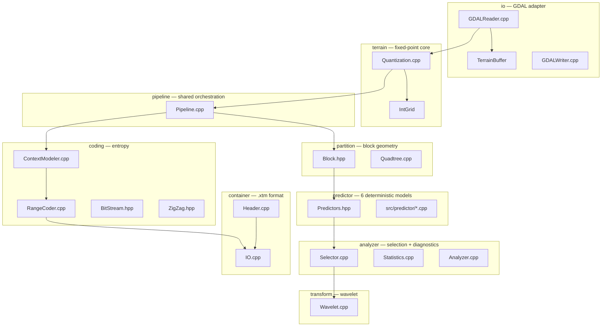
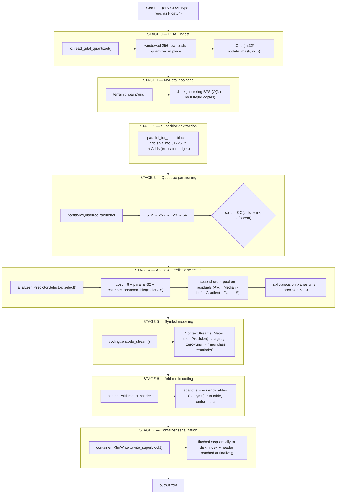
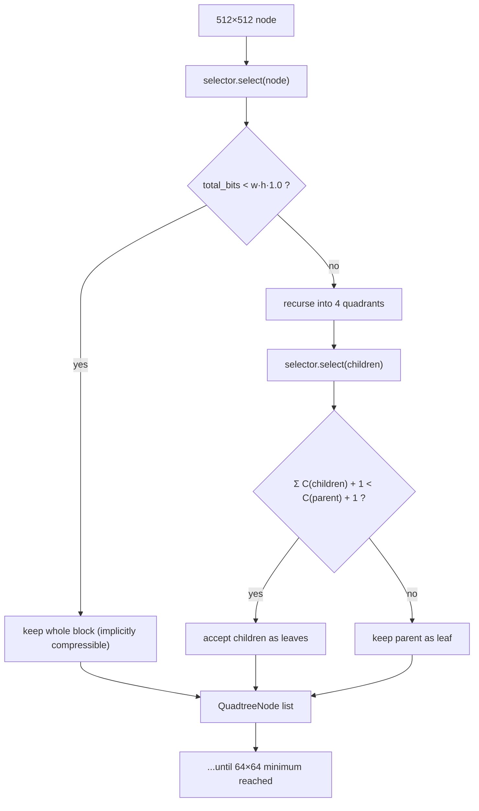
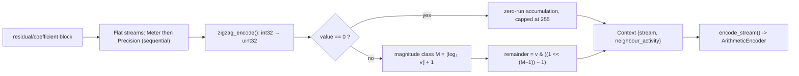
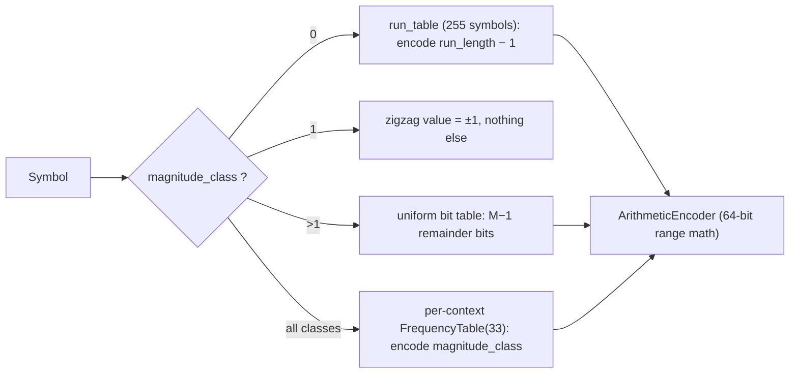
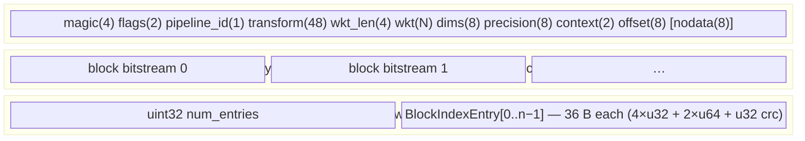
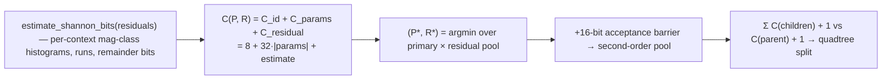
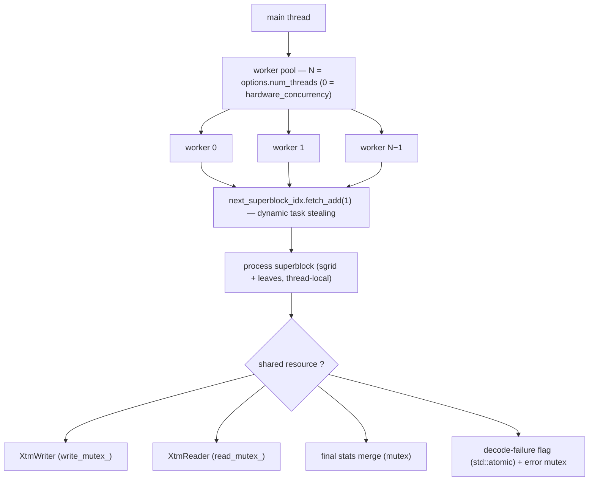

# libxtm Compression Pipeline — Comprehensive Technical Reference

This document is the authoritative walkthrough of libxtm's end-to-end pipeline: how a raw GeoTIFF becomes a `.xtm` file, how a `.xtm` file becomes a GeoTIFF again (including region-of-interest queries), and how `xtm analyze` instruments the pipeline. It documents the **current implementation** (v0.1.0). If the code and this document ever disagree, the code wins — the public headers under `include/xtm/` are the source of truth.

---

## 1. System Map



| Module | Files | Responsibility |
|---|---|---|
| `io` | `GDALReader.cpp`, `GDALWriter.cpp` | Ingest/export via GDAL; adapter layer only |
| `terrain` | `Quantization.cpp`, `Terrain.hpp` | Float64 → fixed-point `IntGrid` conversion, NoData inpainting |
| `partition` | `Quadtree.cpp`, `Block.hpp` | Block views + recursive cost-driven quadtree splitting |
| `predictor` | `Predictors.hpp`, `src/predictor/*.cpp` | 6 deterministic predictors, encode/decode pairs |
| `analyzer` | `Selector.cpp`, `Analyzer.cpp`, `Statistics.cpp` | Per-block predictor selection + full diagnostic report |
| `transform` | `Wavelet.cpp` | Reversible integer CDF 5/3 lifting wavelet (2D, up to 3 levels) |
| `pipeline` | `Pipeline.cpp` | Shared 512×512 superblock worker pool (`parallel_for_superblocks`) + shared partition loop (`for_each_superblock`) |
| `coding` | `RangeCoder.cpp`, `ContextModeler.cpp`, `BitStream.hpp`, `ZigZag.hpp` | Symbol modeling + adaptive arithmetic coding |
| `container` | `Header.cpp`, `IO.cpp` | Binary `.xtm` format, block index, CRC32 |

The core orchestration is split into two layers:

- **`coding::parallel_for_superblocks` (`src/coding/Pipeline.cpp`)** owns the 512×512 superblock slicing and the parallel worker pool. **All** of the encoder (`src/coding/Encoder.cpp`), decoder (`src/coding/Decoder.cpp`), and analyzer (`src/analyzer/Analyzer.cpp`) share this single parallel skeleton by providing their own worker callbacks.
- **`coding::for_each_superblock` (`src/coding/Pipeline.cpp`)** layers the shared extraction + quadtree partition + predictor selection on top of the skeleton: it copies the given `PredictorSelector` per worker, slices each superblock out of the grid, partitions it (quadtree or fixed 64×64), and invokes the handler. The **encoder** and the **analyzer** both drive this single implementation; their handlers only add the encode-payload/statistics logic.
- **`XtmEncoder` / `XtmDecoder`** (`src/coding/Encoder.cpp`, `Decoder.cpp`) perform the actual bitstream coding on the partitioned blocks.

The CLI (`apps/xtm/`, commands `encode`/`decode`/`analyze`/`info`/`verify`) merely wraps these library-level classes for file/GDAL orchestration.

---

## 2. The Encoder Pipeline



The stages run **per 512×512 superblock in parallel** (one worker thread per core, `parallel_for_superblocks`); stages 3–7 run per quadtree leaf block within a superblock.

---

## 3. Stage-by-Stage Detail

### Stage 0 — GDAL Ingest (`src/io/GDALReader.cpp`)

- Opens the dataset with `GDALOpen(path, GA_ReadOnly)`, reads **band 1 only**, always as `GDT_Float64` via `RasterIO` to prevent any truncation.
- Copies the complete 6-element GDAL affine geotransform into `GeoTransform {origin_x, pixel_width, rotation_x, origin_y, rotation_y, pixel_height}`, fully supporting rotated/sheared rasters. When the raster has no geotransform tag (`GetGeoTransform` fails), the `GeoTransform` default member initializers keep the identity `{0, 1, 0, 0, 0, 1}`, so no uninitialized bytes ever reach the `.xtm` header.
- Captures `NoDataValue` (if present) as `std::optional<double>`.
- Reads the precise projection/CRS via `GetProjectionRef()` and stores the raw WKT string into `wkt_projection`; the analyze path additionally resolves the authority code (e.g. `EPSG:32633`) and angular/linear units via `OGRSpatialReference`, and derives the raster extent from the geotransform.

### Stage 1 — Quantization (`src/terrain/Quantization.cpp`)

```cpp
grid.data[idx] = int32(std::round(val * (1.0 / precision)));
```

- All downstream stages operate on `IntGrid {std::vector<int32_t> data, std::vector<uint8_t> nodata_mask, w, h}`.
- Quantized values are **clamped to the int32 range** (non-finite inputs become 0) before the cast, so no float→int UB can reach the coder.
- NoData pixels are zeroed in `data` and flagged in `nodata_mask`, then filled by a **ring-BFS 4-neighbor average inpainting** (`terrain::inpaint`): cells are processed by distance ring from the filled boundary, so each cell is visited exactly once (O(N) total, no full-grid copies per pass) with identical values to the former iterative diffusion. The inpainting exists so predictors never see cliffs; the original mask is serialized per block instead.
- The reconstruction bound is `|z − ẑ| ≤ precision/2`. There is **no true Float32-lossless mode**; `--precision 1.0` is meter precision, not bit-exact.

### Stage 2 — Superblock Extraction (`src/coding/Pipeline.cpp`)

- The global grid is tiled into 512×512 superblocks via `coding::parallel_for_superblocks`.
- **Truncated Boundary Blocks:** Edge blocks are dynamically truncated to exactly fit the grid bounds without any padding (e.g. a grid of width 3600 will produce a final edge superblock of exactly 16×512). This preserves compression efficiency by avoiding padded "junk" pixels.
- Superblocks are the **independence unit**: predictors never read across a superblock boundary, which is what enables ROI decoding.
- A worker pool consumes superblock indices via `std::atomic<uint32_t> next_idx` (dynamic task stealing). Each worker callback creates its own thread-local state (e.g. `sgrid` buffer, `PredictorSelector` copy, leaf vector) and iterates through superblocks provided by a `SuperblockIterator`.

### Stage 3 — Quadtree Partitioning (`src/partition/Quadtree.cpp`)



- Each superblock starts as one node (typically 512×512) and is recursively subdivided down to a 64×64 minimum.
- **Odd-Sized Boundaries:** If a truncated edge superblock is passed (e.g. 16×512), any axis already at or below `min_block_size` halts subdivision on that axis immediately (`width <= min_block_size || height <= min_block_size` → leaf), producing a single rectangular leaf (e.g. one 16×512 block) rather than subdividing the short axis.
- **Split rule:** a node splits into 4 children only when

  ```
  Σ C(children) + 1 bit (split flag) < C(parent) + 1 bit
  ```

  where `C` comes from the selector (Stage 4). Both sides carry the same 1-bit flag cost, so it cancels — but it is bookkept on every node.
- **Early-out heuristics:**
  - blocks at or below `min_block_size` are leaves;
  - blocks with `total_bits < width·height·1.0` (i.e. < 1 bit/sample) are kept whole — an implicit "already compressible" test.
- The returned `QuadtreeNode {block, selection}` set becomes the block list; the split flag is **never serialized** (the decoder re-derives block geometry from the index entries, which store x/y/w/h directly).
- **`--disable-quadtree`:** bypasses the quadtree entirely; the superblock is partitioned into fixed 64×64 blocks via `FixedGridPartitioner::partition`, each with `selector.select(b)`. Useful for A/B testing the quadtree's rate savings. The header records this via `FLAG_DISABLE_QUADTREE` (informational only; decoding is geometry-driven).

### Stage 4 — Adaptive Predictor Selection (`src/analyzer/Selector.cpp`)

**Candidate cost model** — identical in encoder, analyzer, and quadtree:

```text
C(P) = C_id     + C_params        + C_residual
     = 8 bits      params·32 bits    estimate_shannon_bits(residuals)
```

`estimate_shannon_bits` is a **single-pass, context-aware histogram estimator**: it walks the residuals with the same symbol walker the coder uses (`coding::walk_symbols`) — zigzag magnitude classes (0..32), zero-run lengths (1..255, capped), and remainder bits — and returns the Shannon entropy of the per-context magnitude-class streams plus the shared run-length stream plus the raw remainder-bit cost. The per-context split mirrors the coder's `FrequencyTable`s exactly (per-stream, per-activity; both planes scored separately when split-precision is active). **Selection cost does not run the arithmetic coder**; the estimator is an order of magnitude cheaper and its ranking agrees with a real arithmetic encode on normal terrain. The winner is `P* = argmin C(P)`.

```mermaid
flowchart LR
    B["BlockView"] --> SP{"precision < 1.0 ?"}
    SP -- yes --> SPLIT["split into meter (z/mult) + precision (z%mult) planes"]
    SPLIT --> CL
    SP -- no --> CL["quick terrain classification (min/max delta)"]
    CL --> ACT["active meter predictor set"]
    ACT --> EVAL["for each active predictor: encode → estimator cost"]
    EVAL --> SO["second-order pool: re-predict residuals<br/>Average · Median · Left · Gradient · Gap · LeastSquares<br/>(accepted if est + 32·|params| + 16 bits < plain est)"]
    SO --> COST["C(P) = 8 + 32·|params| + estimate"]
    COST --> WIN["M* = argmin over (primary, residual) pairs"]
    WIN --> PREC["if split: P* = argmin over {Left, Gradient, Gap} on precision plane"]
    PREC --> OUT["SelectionResult {best_predictor, best_prec_predictor, use_second_order, best_encoded}"]
```



**Quick terrain classification** prunes the candidate set before evaluation:

| Condition (int32 delta = max−min) | Active predictors |
|---|---|
| `delta == 0` (perfectly flat) | Left only |
| `delta > 200` (very noisy) | all except Polynomial, JPEG-LS |
| otherwise | all 6 |

**Pipelines** (selected by `--pipeline`, stored in the header as `pipeline_id`):

- **`predictor` (default, `PIPELINE_PREDICTOR`)**: predictors run on raw elevations; the winner's residuals are serialized (see Stage 7 for the per-block header fields).
- **`wavelet` (`PIPELINE_WAVELET`)**: the CDF 5/3 forward transform is applied to the **whole block's elevations** first, then the transformed coefficients are serialized directly (no predictor IDs, no per-block DWT switch — the decoder recomputes `max_levels` from block dimensions via `coding::max_wavelet_levels`, max 3). This is the experimental legacy path; **it is only valid with `--precision >= 1.0`** (combining `--pipeline wavelet` with sub-meter precision is unsupported).

**Split-precision** (only when `precision < 1.0`, within either pipeline): the block is split into a meter plane (`z / multiplier`) and a precision plane (`z % multiplier`). The meter plane is predicted by the winner of the full candidate pool; the precision plane is predicted independently by the best of `{Left, Gradient, Gap, Identity}`. Identity (raw passthrough, `0xFE`) codes the digit values with no prediction and wins when they are already incompressible (e.g. uniform noise), where any predictor only widens the residual support. A `0xFF` precision-predictor ID marks "no precision plane" for that block.

**Second-order residual pass**: after each primary predictor candidate produces residuals, the residuals are re-predicted by a pool of residual predictors — `Average (p = W/2 + N/2)`, `Median (p = median(W, N, NW))`, and `Left` / `Gradient` / `Gap` / `LeastSquares` run as primary predictor classes over a zero-bordered view of the residual plane (cells outside the block read as 0 on both sides). Each pool member is costed as `estimate + 32·|params|` and must beat the plain residual estimate by **more than 16 bits** to be accepted — the Shannon estimate cannot see the adaptive run-table overhead, so marginal wins would lose in the real coder. The (primary, residual) pair with the lowest total cost wins the block: the two stages are coupled, since a residual stage can make a different primary predictor win. Only the **meter plane** gets this stage; the precision plane is predicted once with simple predictors only. The pool is skipped when >95% of the residuals are already zero. The 3-bit residual-predictor ID is packed into the predictor byte (5-bit primary ID + 3-bit residual ID), so the signal costs nothing; the decoder reverses the stage (residual-of-residuals → residuals) before the primary predictor runs.

### Stage 5 — Symbol Modeling (`src/coding/ContextModeler.cpp`)



1. **Context Streams** — The block is entirely encoded sequentially, one symbol at a time; no per-block symbol vectors are materialized. When split-precision applies (`ctx.has_precision`), the stream multiplexes `ContextStream::Meter` then `ContextStream::Precision` as two sequential flat streams within the single arithmetic-coded bitstream (the residual vector is `[meter (N samples), precision (N samples)]`).
2. **ZigZag** — signed int32 → unsigned (`0, −1, +1, −2, +2… → 0, 1, 2, 3, 4…`) via `zigzag_encode`.
3. **Zero runs** — within each stream, consecutive zeros collapse into one `{magnitude_class = 0, run_length}` symbol, capped at 255 per symbol.
4. **Magnitude classes** — a nonzero zigzag value `v` becomes `{magnitude_class = M, remainder}` where `M = ⌊log₂ v⌋ + 1` (0..32) and `remainder = v & ((1 << (M−1)) − 1)`.
5. **Contexts** — each symbol carries `Context {stream, neighbour_activity}`. In `Simple` (default) `neighbour_activity` is always 0 (context = stream only). In `Extended` (CLI `--context extended`):
   - a 2-bit activity bucket `max(|W|, |N|)` quantized to `{≤2, ≤8, ≤32, >32}` from the west/north neighbours — the same geometry the second-order residual pass uses.
   There are thus 2 tables in Simple and up to 8 tables (2 streams × 4 activity levels) in Extended. All stream/context logic lives in one shared walker (`walk_symbols`, `PipelineContext.hpp`), used by `encode_stream`, `decode_stream`, and the selection estimator, so the models cannot drift.

### Stage 6 — Entropy Coding (`src/coding/RangeCoder.cpp`, `BitStream.hpp`)

- A classic Witten–Neal–Cleary **arithmetic coder** (`ArithmeticEncoder`/`ArithmeticDecoder`): 32-bit `low`/`high` interval state with `uint64_t` range math, underflow-carried `pending_bits_` renormalization, and a 32-bit `code_` window in the decoder.
- Per-context adaptive `FrequencyTable(33)` (symbols 0..32), sized per stream in `EncodingContext`; frequencies halve when the total reaches 16384 (floor at 1) to prevent overflow.
- `magnitude_class == 0` → the run length is encoded (`run_length − 1`) into a shared run table (255 symbols — runs cap at 255, so the never-emitted 256th symbol is dropped).
- `magnitude_class > 1` → the `M − 1` remainder bits are coded with a uniform `FrequencyTable(2)` (≈1 bit/bit).
- The decoder resolves symbols by **binary search** on the cumulative frequency table (O(log 33)).



### Stage 7 — Container Serialization (`src/container/Header.cpp`, `IO.cpp`)

**Per-block bitstream layout** (written by `XtmEncoder`, read by `XtmDecoder`):

| Field | Bits | Notes |
|---|---|---|
| predictor ID + residual ID | 8 | low 5 bits = `PredictorId`, high 3 bits = `ResidualPredictorId` (0 = none) |
| precision predictor ID | 8 | only when `precision < 1.0`; `0xFF` = no split-precision, `0xFE` = raw passthrough (identity) |
| parameter count | 8 | |
| parameters | 32 each | fixed-point int32 params (Polynomial / LeastSquares) |
| residual parameter count | 8 | only when residual ID ≠ 0 |
| residual parameters | 32 each | fixed-point int32 params (residual LeastSquares) |
| block has nodata | 1 | |
| nodata mask (RLE) | 8 per run | runs chunked at 255 → (255, 0) pairs |
| residual stream | variable | arithmetic-coded magnitude classes + run lengths + remainder bits |

The `wavelet` pipeline omits the predictor fields entirely: the block payload is just the nodata bit + the arithmetic-coded coefficient stream.

**File layout**:



```text
┌────────────────────────────────────────────┐
│ XtmHeader (variable) ← placeholder written │
│                      first, rewritten at   │
│                      finalize() with the   │
│                      real index_offset     │
├────────────────────────────────────────────┤
│ block bitstream 0                          │
│ block bitstream 1                          │  ← sorted by sequence_id =
│ …                                          │     (superblock_idx << 32) | leaf_idx
├────────────────────────────────────────────┤
│ uint32 num_entries                         │
│ BlockIndexEntry[0..n−1]  (36 B each)       │
└────────────────────────────────────────────┘
```

- **Deterministic ordering:** `XtmWriter::write_superblock` accepts completed superblocks from worker threads and immediately streams them to disk if they match the next expected `sequence_id` (`expected_s_idx_`). This guarantees the quadtree Z-order required for decoding, independent of worker scheduling, while bounding the writer's memory overhead strictly to `O(num_threads * superblock_size)` rather than `O(file_size)`.
- **CRC32:** each payload is checksummed and verified on read.
- **Header:** `magic "XTM\0"`, `flags`, `pipeline_id`, full 6-parameter `transform` (48 B), length-prefixed `wkt_projection`, `grid_width/height`, `precision` (double), `context_model` (0=Simple, 1=Extended), `index_offset`, and `nodata_value` (only when `FLAG_HAS_NODATA`).

| Flag | Value | Meaning |
|---|---|---|
| `FLAG_HAS_NODATA` | `1 << 1` | header carries `nodata_value` |
| `FLAG_DISABLE_QUADTREE` | `1 << 3` | encode used fixed 64×64 blocks (informational) |

---

## 4. The Decoder Pipeline

```mermaid
flowchart TB
    X["input.xtm"] --> H["read header + validate<br/>magic · context_model ≤ 1<br/>index offset within file · index size within file"]
    H --> ROI{"--region x y w h ?"}
    ROI -- no --> ROI2["full grid: rw = grid_width, rh = grid_height"]
    ROI -- yes --> ROI2
    ROI2 --> SBX["compute intersecting superblock range"]
    SBX --> WORK["for each intersecting superblock (parallel):"]

    subgraph SB["per superblock"]
        direction TB
        W1["filter index entries inside superblock (file order = Z-order, no sort)"]
        W2["for each block:"]
        W3["read bitstream → CRC32 check + bounds check"]
        W4["BitReader: predictor+residual IDs (validated) · precision predictor ID · params · residual params · nodata RLE"]
        W5["ArithmeticDecoder: per-context magnitude classes + run lengths + remainder bits<br/>(max_levels recomputed via coding::max_wavelet_levels)"]
        W6["second-order reversal if signaled → primary predictor->decode into superblock grid<br/>(Split precision planes decoded inline when precision predictor is present)"]
        W1 --> W2 --> W3 --> W4 --> W5 --> W6
    end

    WORK --> SB --> MERGE["copy superblock pixels intersecting ROI into roi_grid"]
    MERGE --> DQ["dequantize (int / multiplier, re-apply nodata_value)"]
    DQ --> OUT["write GeoTIFF (DEFLATE · PREDICTOR=3 · TILED, row by row)"]
```



Key properties:

- **ROI decoding:** only superblocks intersecting `[rx, rx+rw) × [ry, ry+rh)` are touched; per-superblock work is identical to a full decode. The `--region` flag is the only geometry-adaptive part. The output geotransform origin is shifted by the ROI offset (`origin_x += rx·pixel_width + ry·rotation_x`, `origin_y += rx·rotation_y + ry·pixel_height`) so the cropped TIFF is georeferenced correctly.
- **Determinism:** the decoder is fully deterministic given the file — it never depends on encode thread scheduling because the index supplies (x, y, w, h) and byte offsets, and payloads are laid out in Z-order by the `XtmWriter`. Encode is byte-reproducible across runs as well: every header field is deterministically initialized (the geotransform falls back to identity defaults), so two encodes of the same raster with the same settings produce identical `.xtm` files.
- **Silent-corruption guards:** header magic/context-model checks, index-region and block-region bounds checks, per-block CRC32, predictor-id validation, a zero-run bound clamp in the stream decoder (a corrupt stream can never write out of the block buffer), and a bitstream underflow check on decode (excess bits past end-of-stream).
- **Pipelines:** everything is read back from the header — `context_model`, `precision` (→ split-precision), `pipeline_id` (predictor vs wavelet). The caller supplies only the ROI and thread count; there is no CLI knob to override the recorded model, since a mismatched model silently decodes to garbage.

---

## 5. The Analyzer Pipeline (`src/analyzer/Analyzer.cpp`)

`xtm analyze` runs the **same pipeline code as the encoder** — `analyze_terrain(grid, raw, ctx, options)` drives `coding::for_each_superblock` with the same `QuadtreePartitioner` and `PredictorSelector` — and instruments it per superblock through the callback. All reported figures come from the same `estimate_shannon_bits` model the selection uses (context-aware, exported with per-component output), so the report's estimate mirrors the encoder's own cost accounting.

The report is a **decision report** — each section answers one practical question:

1. **Dataset Overview** — dimensions, NoData share, raw elevation range/mean/stddev (computed *inside* `read_gdal_quantized`'s windowed load, so no whole-grid Float64 buffer is needed), p1/p25/p50/p75/p99 percentiles and a 50-bucket elevation sparkline (both estimated from a deterministic stride sample of the raw values), quantized-grid stats at the requested precision, horizontal/vertical/diagonal Pearson correlation of the quantized grid, and — when the source is georeferenced — CRS/EPSG code, pixel size, and bounding box surfaced from the dataset header.
2. **Compressibility & Precision Guidance** — the estimated coding cost (`budget.total_bpp`) and estimated file size (cost bits + 36 B/block index + header) at the requested precision, plus a ± spread derived from the per-leaf selection-bit variance. When the precision is a power of ten below 1.0 (e.g. 0.01), the analyzer **re-runs the selection pass on coarser grids derived by ÷10, ÷100** and reports a precision-vs-size table (each row is a real selection pass, not an independence approximation). Digit-plane entropies (10-bin histograms of each decimal digit of the quantized magnitudes, O(1) memory) are reported as informational "where the detail lives" figures — a single plane collapses to one key/value line.
3. **Predictor Analysis** — for each of the 6 predictors, one whole-512×512-superblock encode: the encoder-model cost (`selection_bpp` = 8 + 32·|params| + estimate), the true residual Shannon entropy (`shannon_bpp`), the share of quadtree leaves chosen (rendered as a usage bar chart on wide terminals), and mean |residual|. Ranked by selection bpp, plus the quadtree's overall winner (marked `← encoder pick`), the second-order pass adoption, and — when the usage winner differs from the lowest-Shannon predictor while still winning on selection cost — a callout explaining the trade-off.
4. **Quadtree Analysis** — leaf counts by size (bar chart scaled by leaf count), total blocks, average block area, and partition + header overhead bpp.
5. **Entropy Budget** — where the estimated bits go: zigzag magnitude-class entropy, zero-run entropy, fixed remainder bits, predictor parameters (32 bits each), and overhead (quadtree structure bits + 8-bit predictor id + 8-bit parameter count + nodata flag per block; the split-precision id byte is included when `precision < 1`). The total is the same number section 2 reports; on wide terminals a proportional stacked bar shows the split at a glance.
6. **Wavelet Evaluation** (`--wavelet`) — a per-leaf CDF 5/3 transform with `max_wavelet_levels` applied to the selected partition, scored with the same estimator, against the predictor estimate (like-for-like, no ids/overhead). Recommends the cheaper pipeline.
7. **Summary** — a TL;DR card (✓/⚠ lines for ratio, terrain character, predictor fallback, wavelet recommendation) followed by the plain-language recommendations: biggest precision step, pipeline choice, terrain character, and timings — per-phase share of worker time (quadtree / predictor eval / entropy, summed across parallel superblocks) plus wall-clock load/analysis.

Output modes: `--json` prints the full report as machine-readable JSON on stdout (nothing else; errors go to stderr), `--compact` prints only sections 1 and 7, and `--no-color` disables ANSI styling (also disabled automatically when stdout is not a TTY or `NO_COLOR` is set). Section headers, table columns, and the predictor-usage/leaf-share/budget bars adapt to the terminal width.

Determinism: every per-superblock accumulator writes to a slot indexed by `s_idx` (exactly one handler invocation per slot), and all reductions iterate the slots **in order**, so the report is byte-reproducible for a given grid and settings. The only run-to-run differences are the wall-clock line and the phase-timing shares.

---

## 6. The Rate-Cost Model (the "why" behind every decision)

Everything adaptive is driven by one principle — *minimize estimated encoded bits*:

| Decision | Criterion |
|---|---|
| Predictor choice | `C(P, R) = 8 + 32·(|params| + |rparams|) + estimate` over (primary, residual) pairs |
| Second-order pool | `estimate + 32·|params| + 16 < plain estimate` (3-bit ID is free — packed in the predictor byte) |
| Quadtree split | `Σ₄ C(children) + 1 < C(parent) + 1` |
| Wavelet (whole-pipeline) | chosen up front via `--pipeline`; `max_levels` from block size |
| Wavelet (analyze only) | measured DWT estimate vs predictor estimate on the selected partition (`--wavelet`) |



The `+16`/`+1` flag costs and the 8-bit ID cost are what prevent gratuitous per-block adaptivity. All costs are **estimates of the symbol streams** (not runs of the arithmetic coder); empirically the estimator's ranking agrees with an actual arithmetic encode on representative terrain, at a fraction of the cost — this is what keeps selection cheap enough to run inside the quadtree recursion. (The 16-bit barrier is a *conservatism* term, not a stream cost: it compensates for adaptation overhead of the run table that the Shannon estimate cannot see.)

---

## 7. Threading & Memory Model



- **Encode/Decode/Analyze:** N workers via `parallel_for_superblocks`, dynamic task stealing on the superblock index. Each worker callback holds its own thread-local state (e.g. `sgrid`, `PredictorSelector`, `BitWriter` for encode, or block buffers for decode) and loops over the superblocks it receives.
- **Shared state:** `XtmWriter` (mutexed), `XtmReader` (mutexed), final stats merge (mutexed), decode-failure flag + error string (atomic + mutex).
- **Memory notes (bounded by design):**
  - Encode (`xtm encode`), verify (`xtm verify`), and analyze (`xtm analyze`) ingest via `io::read_gdal_quantized`: the raster is read in 256-row windows (GDAL block cache capped at 64 MB) and quantized straight into the `IntGrid`, so the full Float64 `TerrainBuffer` (8 B/px) never exists. Peak is `O(grid)` for the `IntGrid` (5 B/px) plus worker scratch. Raw elevation statistics are accumulated inside the windowed read, so no path holds a whole-grid Float64 copy; percentile/histogram estimation adds a bounded ~256 K-value stride sample.
  - Decode (`xtm decode`) writes through `io::GdalWriter` in 256-row bands via `terrain::dequantize_rows`, so the full Float64 output buffer (8 B/px) never exists either; peak is the ROI `IntGrid` (5 B/px) plus a band buffer.
  - `XtmWriter` explicitly enforces an `O(superblock)` memory bound by sequentially flushing superblocks to disk as soon as they arrive in order.
  - Block-level scratch (residuals, bitstreams) is reused per worker, so per-thread footprint is O(superblock).

---

## 8. Lockstep Invariants (must never drift)

These pairs must stay bit-for-bit identical or the codec silently corrupts data:

| Invariant | Where duplicated |
|---|---|
| Predictor order / IDs (0 = Gradient, 1 = Left, 2 = JpegLs, 3 = Polynomial, 4 = Gap, 5 = LeastSquares) | `PredictorId` enum — frozen; add new predictors at the end only |
| Context definition + model (Simple/Extended) | `PipelineContext.hpp`/`ContextModeler.cpp` — `encode_stream()`/`decode_stream()`/`estimate_shannon_bits()` all use the one shared `walk_symbols()` (2-bit activity buckets, 255-symbol run table) |
| Zero-run cap (255), magnitude-class max (32), remainder bypass | `ContextModeler.cpp` (encode) vs `ContextModeler.cpp` (decode) — same file |
| Predictor encode formula == decode formula | per-predictor `encode()`/`decode()` pairs |
| Second-order pool == its reversal | `Selector.cpp` (pool encode) vs `Decoder.cpp` (reversal) — Average/Median inline kernels, Left/Gradient/Gap/LeastSquares reuse the predictor classes over an identical zero-bordered residual-plane view |
| Wavelet forward == inverse | `CDF53Transform` (round-trip tested) |
| Quantize precision ↔ dequantize precision | `quantize`/`dequantize` + `header.precision` |
| Split-precision multiplier | `precision_multiplier` derivation (round(1/precision)) + inline combination in `Decoder.cpp` |
| Selection estimator == coder symbol model | `estimate_shannon_bits` (Selector) vs `encode_stream` (ContextModeler) — one shared `walk_symbols` |
| `max_wavelet_levels` derivation | single helper in `ContextModeler.hpp`, used by encoder, decoder, and analyzer |

---

## 9. Key Constants

| Constant | Value | Location |
|---|---|---|
| Superblock size | 512 | `parallel_for_superblocks` (Encoder/Analyzer/Decoder) |
| Quadtree min block | 64 | `QuadtreePartitioner` callers |
| Quadtree max block | 512 | `QuadtreePartitioner` callers |
| Predictor count | 6 | `PredictorId` enum |
| Wavelet levels | ≤ 3 | `coding::max_wavelet_levels()` |
| Predictor ID bits | 8 | bitstream |
| Parameter bits | 32 | bitstream |
| Magnitude classes | 33 (0..32) | `FrequencyTable(33)` |
| Zero-run cap | 255 | ContextModeler |
| Run-table symbols | 255 | EncodingContext |
| Table priors | terrain-skewed | EncodingContext |
| Frequency rescale threshold | 16384 | `FrequencyTable::increment` |
| Noise-class delta | 200 | Selector quick classification |
| Analyzer per-block overhead | 17 bits (25 with split precision) | id(8) + param count(8) + nodata flag(1), + prec id(8); residual-param count byte extra when the pool fires |

---

## 10. File Format Summary

| Section | Bytes | Content |
|---|---|---|
| Header | variable | magic(4) flags(2) pipeline_id(1) transform(48) wkt_len(4) wkt(N) dims(8) precision(8) context(2) offset(8) [nodata(8)] |
| Block payloads | variable | one bitstream per quadtree leaf (see §3 Stage 7), in `sequence_id` (Z-)order |
| Index | 4 + 36·n | entry count + per-block `{x,y,w,h,offset,length,crc32}` |
| Header re-write | — | `index_offset` patched at `finalize()` |

The format is deliberately **unversioned** — the project is pre-1.0, so there is no backward compatibility: the decoder accepts exactly the layout described here (and only the magic signature can be wrong in a way it will reject). The predictor byte packs a 5-bit primary `PredictorId` and a 3-bit `ResidualPredictorId`; the precision-predictor byte uses `0xFF` for "no split-precision" and `0xFE` for the identity (raw passthrough) choice.

Checksums (CRC32) exist per block and are verified on read; there is no whole-file checksum or header checksum.

---

## 11. Relationship to the Docs

- **`README.md`** — quick start: features, build, and CLI usage.
- **`libxtm_spec.md`** — target architecture / aspiration. Known current gaps: no rANS (range/arithmetic coder used), no lossless-Float32 mode, no multiresolution pyramids, `xtm benchmark` CLI missing (the CLI instead provides `info`/`verify`).
- **`tests/unit/`** — the behavioral spec: round-trip losslessness (flat/ramp/noise/checkerboard), ROI-crop-vs-full-decode equality, thread determinism, sub-meter precision, container/header corruption handling. Run via `ctest`.
- **`utils/`** — research helpers: `benchmark_suite.py`, `benchmark_roi.py`, `download_copernicus.py`.
